# Universidad de San Carlos de Guatemala

## Facultad de Ingeniería
### Escuela de Ciencias y Sistemas
#### Laboratorio de Arquitectura De Computadores Y Ensambladores 1 - Sección A
Ing. Luis Fernando Espino 
Auxiliar: Diego Jose Guevera Abaj
| No | Nombre                                        | Carné     |
|----|-----------------------------------------------|-----------|
| 1  | Bryan Josué coronado Laínez                   | 202209258 |
| 2  | Anguel Jose Miguel Davila Aspuac              | 202300360 |
| 3  | Miguel Angel Kanek Balan Velasco              | 202300765 |
| 4  | Derek Francisco Orellana Ibáñez             | 202001151 |
| 5  | Edwin Alexander Jax Lopez                     | 202200338 |

Guatemala, 27 de Junio del 2025.

<div align="center">

# MANUAL TECNICO
</div>

<div align="center">

### Proyecto Único – Fase 2
### Sistema Inteligente de Evaluación y Predicción Ambiental
</div>

<div align="center">

### INTRODUCCION
</div>

El sistema desarrollado integra múltiples funciones orientadas al monitoreo ambiental inteligente, utilizando una Raspberry Pi conectada a diversos sensores. Este módulo permite la recolección periódica de variables como temperatura, humedad, iluminación, presión barométrica, presencia o proximidad, y calidad del aire, presentando la información en tiempo real a través de una pantalla LCD y generando alertas locales según sea necesario.

A través de comunicación IoT basada en el protocolo MQTT, los datos recolectados son publicados en diferentes tópicos, permitiendo tanto el envío como la recepción de mensajes de control para la gestión remota de dispositivos. Esta arquitectura garantiza una comunicación bidireccional eficiente y desacoplada entre la Raspberry Pi y el dashboard web.

El sistema cuenta con una interfaz web que ofrece funcionalidades como autenticación de administrador, visualización en tiempo real de los datos, reportes históricos mediante gráficas, y un módulo de control remoto para los actuadores mediante MQTT.

Además, se implementa un mecanismo de gestión automática de alertas, tanto visuales en la pantalla LCD como en el dashboard web, y un control de actuadores (ventilador, iluminación, etc.) que responden automáticamente ante condiciones ambientales específicas, como temperaturas elevadas o baja iluminación.

## EL SISTEMA PERMITE
###     Funciones

#### Adquisición de Datos (Raspberry Pi + Sensores)

- Lectura periódica de:
  - Temperatura y humedad.
  - Nivel de luz.
  - Presión barométrica.
  - Detección de presencia o proximidad.
  - Calidad del Aire.
- Mostrar información en tiempo real en una pantalla LCD.
- Generación de alertas locales.

#### Comunicación IoT (MQTT)

- Publicar datos recolectados a través de tópicos MQTT:
  - Ejemplo: `GRUPO#6/sensores/rasp01/temperatura`
- Escuchar mensajes desde un tópico de control para la activación o desactivación de dispositivos de acción.
- Asegurar comunicación bidireccional desacoplada entre el dashboard y la Raspberry Pi.

#### Dashboard Web

- Login de administrador.
- Módulos principales:
  - Panel general con datos en tiempo real.
  - Reporte histórico (gráficas de los datos almacenados).
  - Apartado de control remoto de actuadores por medio de MQTT.

#### Gestión de Alertas Automáticas

- Activación de alertas visuales (LCD y dashboard web).

#### Control de Actuadores (Relay, Motor DC, Leds)

- Activación o desactivación de un ventilador en caso de que la temperatura exceda un umbral.
- Activación de luz adicional si la iluminación es baja.

## Objetivo General

Desarrollar un sistema IoT capaz de procesar, analizar y predecir datos ambientales, mediante la integración de cálculos estadísticos y modelos predictivos en lenguaje ensamblador ARM64, con almacenamiento en MongoDB y visualización avanzada en Grafana.

## Objetivos Específicos

1. **Implementar funciones estadísticas básicas en lenguaje ARM64** (media, moda, mediana, varianza, etc.) para analizar datos recolectados en la Fase 1.

2. **Desarrollar modelos de predicción simples** como Media Móvil y Suavizado Exponencial, codificados en ARM64.

3. **Establecer un mecanismo de integración entre Python y ARM64**, donde el sistema principal (Python) invoque los cálculos escritos en ensamblador con parámetros provenientes de los datos recolectados.

4. **Analizar y presentar resultados obtenidos** de los cálculos estadísticos y modelos predictivos en el dashboard y en la LCD de la Fase 1.

5. **Fortalecer la comprensión de la arquitectura ARM64** y su uso práctico en escenarios de procesamiento de datos reales.

6. **Integrar MongoDB Atlas como base de datos** para el almacenamiento histórico de sensores y resultados analíticos.

7. **Configurar y personalizar paneles en Grafana** para mostrar datos históricos y resultados analíticos en tiempo real.

8. **Visualizar en LCD y en el dashboard web** los resultados analíticos obtenidos.

## Descripción del Proyecto

Esta fase amplía la funcionalidad de SIEPA para convertirlo en un sistema inteligente completo. Los datos recolectados en la Fase 1 (temperatura, humedad, iluminación, presión) serán almacenados de forma continua en MongoDB y analizados mediante algoritmos estadísticos y modelos de predicción implementados en lenguaje ensamblador ARM64, ejecutados nativamente en la Raspberry Pi.

### Arquitectura del Sistema

El sistema Python actuará como orquestador:
- Extraerá subconjuntos de datos de MongoDB
- Invocará al código ARM64
- Recibirá los resultados
- Los desplegará en:
  - La pantalla LCD local
  - El dashboard web desarrollado en la Fase 1
  - Grafana, que ofrecerá visualizaciones históricas avanzadas y monitoreo

### Componentes Principales

- **Sensores ambientales**: Temperatura, humedad, iluminación, presión
- **Procesamiento ARM64**: Cálculos estadísticos y modelos predictivos
- **Base de datos**: MongoDB Atlas para almacenamiento histórico
- **Visualización**: 
  - LCD local
  - Dashboard web
  - Grafana para análisis avanzado
- **Orquestador**: Sistema Python que coordina todos los componentes

# Sensores y Dispositivos de Salida

## 1. Temperatura y Humedad: DHT11 / DHT22

- **DHT11**:
  - Mide temperatura (0–50 °C) y humedad (20–80%)
  - Menor precisión, económico.
- **DHT22**:
  - Mide temperatura (-40 a 80 °C) y humedad (0–100%)
  - Mayor precisión y rango que el DHT11.

## Capas del IoT Stack Framework

- **Capa de Percepción**: Sensores conectados a la Raspberry Pi
- **Capa de Red**: Comunicación MQTT para transmisión de datos
- **Capa de Procesamiento**: Python + ARM64 para análisis y predicción
- **Capa de Almacenamiento**: MongoDB Atlas como base de datos central
- **Capa de Visualización**: LCD, Dashboard Web y Grafana

## Hardware Utilizado

### Raspberry Pi 4 (ARM64)

### Sensores
- DHT11/DHT22 (temperatura y humedad)
- Fotoresistencia (LDR)
- HC-SR04 o PIR (presencia)
- BMP280 (presión barométrica)
- MQ135 (Calidad del aire)

### Actuadores
- LEDs, Buzzer, Motor DC
- Pantalla LCD I2C

## Flujo General del Sistema

1. **Recolección de Datos**: Python toma lecturas periódicas desde sensores
2. **Almacenamiento**: Los datos son almacenados automáticamente en MongoDB (cada 30 segundos o cada minuto)
3. **Procesamiento**:
   - Python extrae las últimas n muestras (ej. 30, min: 20) desde MongoDB
   - Se envían al ejecutable ARM64
   - ARM64 procesa los datos (estadísticas + predicción)
4. **Visualización**:
   - Resultados mostrados en la pantalla LCD
   - Datos calculados en Dashboard Web (Puede ser una ventana extra)
   - Datos Guardados de la DB (Puede ser una ventana extra) (min 20 datos)
   - Resultados históricos en Grafana (vía conexión a MongoDB)

## Estadísticas y Modelos en ARM64

### Estadísticas
- Media
- Mediana
- Moda
- Mínimo / Máximo
- Desviación estándar
- Varianza

### Modelos de Predicción
- Media Móvil (MA)
- Suavizado Exponencial (SES)

## Integración Python ↔ ARM64

- **Entrada**: Python lee datos desde MongoDB y genera un archivo temporal o pasa argumentos por stdin
- **Ejecución**: Se invoca el ejecutable ARM64 (compilado en aarch64-linux-gnu)
- **Salida**: ARM64 imprime los resultados en formato legible o archivo
- **Lectura y Visualización**: Python recoge resultados y los presenta

## MongoDB Atlas

### Almacenamiento centralizado de:
- Lecturas de sensores
- Resultados analíticos
- Registros de predicción

### Colecciones:
- `lecturas_sensores` → {hora-fecha, iluminación, temperatura, etc}
- `estadisticas_resultados` → {hora-fecha, sensorde, media, varianza, etc}
- `predicciones` → {hora-fecha, sensorde, mediaMovil, suavizado}
- `alertas` → {hora-fecha, sensorde, valor}

## Grafana

Integrado con MongoDB como fuente de datos (a través de un conector como Grafana MongoDB Data Source Plugin o puente intermedio con InfluxDB).

### Paneles:
- Temperatura histórica
- Alertas críticas (Opcional)
- Predicciones vs. datos reales
- Resumen analítico (media, varianza, etc.)

## Visualización LCD

Pantalla alterna entre los siguientes modos (Cuando se solicite en el dashboard):
- Valores actuales
- Resultados estadísticos
- Predicciones

## Resumen del archivo `.gitignore`
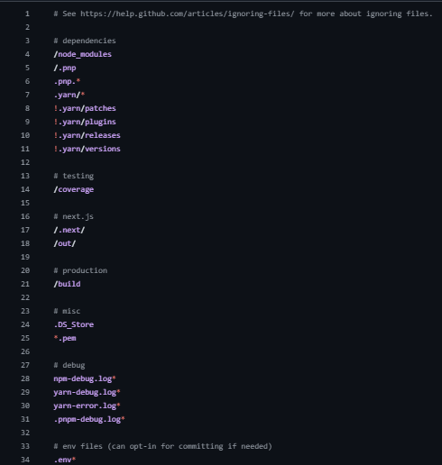

Este archivo `.gitignore` especifica qué archivos y carpetas deben ser ignorados por Git. A continuación, se resumen las categorías:
### Dependencias
- Se ignoran los directorios y archivos relacionados con los manejadores de paquetes como `node_modules`, `.pnp` y la mayoría del contenido de `.yarn`, excepto subdirectorios importantes (`patches`, `plugins`, `releases`, `versions`).

### Pruebas
- Se ignora la carpeta `coverage`, que contiene resultados de cobertura de pruebas.

### Next.js
- Se excluyen las carpetas de construcción de Next.js como `.next` y `out`.

### Producción
- Se ignora la carpeta `build`, utilizada para builds de producción.

### Misceláneo
- Archivos del sistema y certificados como `.DS_Store` y `*.pem` son ignorados.

### Depuración
- Archivos de logs de errores y depuración generados por npm, yarn y pnpm son ignorados.

### Archivos de entorno
- Se excluyen todos los archivos `.env`, aunque se pueden incluir manualmente si es necesario.

### Vercel
- Se ignora la carpeta `.vercel` utilizada por la plataforma de despliegue Vercel.

### TypeScript
- Se ignoran archivos generados como `*.tsbuildinfo` y `next-env.d.ts`.

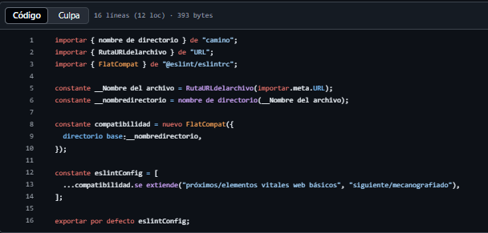
## Resumen del código de configuración ESLint (usando `FlatCompat`)

Este archivo configura ESLint utilizando la API moderna de configuración plana (`FlatConfig`) con compatibilidad para configuraciones tradicionales mediante `FlatCompat`.

### Detalles del código:

- **Importaciones clave:**
  - `dirname` y `fileURLToPath` son usados para obtener la ruta del archivo actual (`__dirname`).
  - `FlatCompat` proviene de `@eslint/eslintrc` y permite convertir configuraciones tradicionales a la forma plana.

- **Resolución de ruta:**
  - `__filename` y `__dirname` se generan a partir de `import.meta.url` para ser compatibles con módulos ES.

- **Compatibilidad:**
  - Se crea una instancia de `FlatCompat` usando el directorio base del archivo actual.

- **Extensiones ESLint:**
  - Se agregan configuraciones predefinidas de Next.js:
    - `"next/core-web-vitals"`
    - `"next/typescript"`

- **Exportación:**
  - `eslintConfig` se exporta como la configuración por defecto del archivo.

### Propósito
Este archivo permite integrar reglas de ESLint de Next.js con soporte para TypeScript, dentro de un entorno que utiliza la nueva forma plana de configuración.

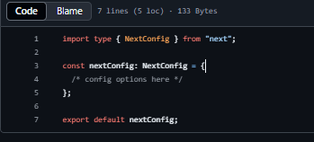
## Resumen del archivo de configuración de Next.js

Este archivo define la configuración base para un proyecto Next.js utilizando TypeScript.

### Características principales:

- **Importación con `type`:**
  - Se importa únicamente el tipo `NextConfig` desde el paquete `next` para asegurar el tipado estático en TypeScript.

- **Definición de configuración:**
  - Se declara un objeto `nextConfig` del tipo `NextConfig`.
  - Actualmente está vacío (`/* config options here */`), pero se puede personalizar con opciones como:
    - `reactStrictMode`
    - `images`
    - `i18n`
    - `webpack`
    - `experimental`
    - entre otras.

- **Exportación:**
  - `nextConfig` se exporta como la configuración predeterminada para que Next.js lo utilice.

### Propósito
Proveer una plantilla tipada para definir y exportar la configuración del framework Next.js en un proyecto.

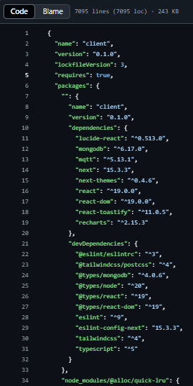
## Resumen del archivo `package-lock.json`

Este archivo bloquea las versiones exactas de las dependencias utilizadas en un proyecto de Node.js para garantizar instalaciones consistentes.

### Información general

- **Nombre del proyecto:** `client`
- **Versión:** `0.1.0`
- **Versión del lockfile:** `3` (usada por npm 9+)

---

### Dependencias de Producción (`dependencies`)

Incluyen bibliotecas necesarias para ejecutar la aplicación:

- **lucide-react:** Íconos en React.
- **mongodb:** Cliente para interactuar con bases de datos MongoDB.
- **mqtt:** Cliente para protocolo de mensajería MQTT.
- **next:** Framework para React (versión `15.3.3`).
- **next-themes:** Manejo de temas oscuros/claro en Next.js.
- **react / react-dom:** Librerías fundamentales de React.
- **react-toastify:** Notificaciones tipo "toast".
- **recharts:** Librería para gráficos en React.

---

### Dependencias de Desarrollo (`devDependencies`)

Incluyen herramientas para desarrollo, compilación y análisis de código:

- **@eslint/eslintrc:** Compatibilidad con configuraciones antiguas de ESLint.
- **@tailwindcss/postcss:** Integración de Tailwind CSS con PostCSS.
- **@types/\***: Tipos para TypeScript (Node, React, etc.).
- **eslint / eslint-config-next:** Linter y reglas para proyectos Next.js.
- **tailwindcss:** Framework CSS utilitario.
- **typescript:** Lenguaje tipado para JavaScript.

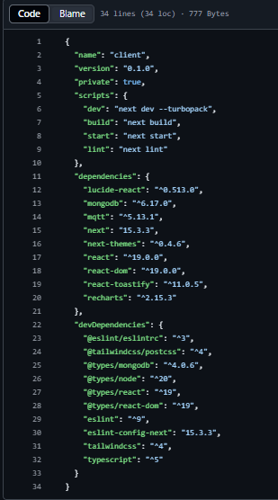
## Resumen del archivo `package.json`

Este archivo define la configuración principal del proyecto Node.js/Next.js llamado `client`.

---

### Información General

- **Nombre del proyecto:** `client`
- **Versión:** `0.1.0`
- **Privado:** `true` (no se puede publicar en el registro de npm)

---

### Scripts

Comandos útiles para el desarrollo y despliegue:

- **`dev`**: Inicia el servidor de desarrollo con Turbopack (`next dev --turbopack`).
- **`build`**: Compila la aplicación para producción (`next build`).
- **`start`**: Inicia el servidor Next.js en modo producción (`next start`).
- **`lint`**: Ejecuta el linter con configuración de Next.js (`next lint`).

---

### Dependencias (`dependencies`)

Bibliotecas requeridas para ejecutar la aplicación:

- `lucide-react`: Íconos SVG para React.
- `mongodb`: Cliente para conectarse a MongoDB.
- `mqtt`: Cliente MQTT para comunicación en tiempo real.
- `next`: Framework de React para renderizado del lado del servidor (versión `15.3.3`).
- `next-themes`: Soporte para temas oscuros/claros.
- `react` y `react-dom`: Librerías principales de React (`19.0.0`).
- `react-toastify`: Notificaciones tipo "toast".
- `recharts`: Gráficos reutilizables en React.

---

### Dependencias de Desarrollo (`devDependencies`)

Herramientas y utilidades para desarrollo:

- `@eslint/eslintrc`: Soporte para configuración clásica de ESLint.
- `@tailwindcss/postcss`: Integración de Tailwind con PostCSS.
- `@types/*`: Tipos TypeScript para bibliotecas clave (`node`, `react`, `react-dom`, `mongodb`).
- `eslint` y `eslint-config-next`: Herramientas de linting.
- `tailwindcss`: Framework CSS de utilidad.
- `typescript`: Soporte para desarrollo con TypeScript.

---

### Propósito

Este `package.json` define un entorno moderno de desarrollo web utilizando Next.js, React 19, TypeScript, Tailwind CSS, y soporte para bases de datos (MongoDB) y comunicación en tiempo real (MQTT).

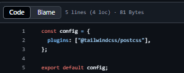
## Resumen del archivo de configuración PostCSS

Este archivo exporta una configuración para PostCSS, centrada en la integración con Tailwind CSS.

---

### Descripción del contenido:

- **Objeto `config`**:
  - Define una propiedad `plugins` con un arreglo que contiene el plugin `@tailwindcss/postcss`.

- **Exportación por defecto**:
  - El objeto de configuración es exportado como `default`, para que pueda ser utilizado por herramientas que consumen la configuración de PostCSS (como Vite, Webpack, etc.).

---

### Propósito

Habilita el procesamiento de estilos CSS con PostCSS, específicamente usando las utilidades de Tailwind CSS a través del plugin `@tailwindcss/postcss`.

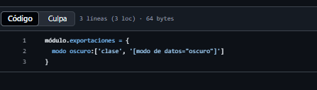
## Resumen de configuración de Tailwind CSS

Este fragmento configura el comportamiento del modo oscuro en Tailwind CSS.

---

### Detalles de configuración

- **`darkMode`**:
  - Se establece como un arreglo con dos valores:
    - `"class"`: habilita el modo oscuro cuando existe una clase `dark` en el HTML.
    - `"[data-mode=\"dark\"]"`: también habilita el modo oscuro si existe un atributo `data-mode="dark"` en un elemento.

---

### Propósito

Permite a Tailwind CSS aplicar estilos oscuros en dos escenarios distintos:
1. Cuando el elemento tiene la clase `dark`.
2. Cuando el atributo `data-mode="dark"` está presente, útil para componentes más personalizados o frameworks que no manejan clases directamente.

Esto proporciona flexibilidad para gestionar el tema oscuro de forma programática o mediante atributos.

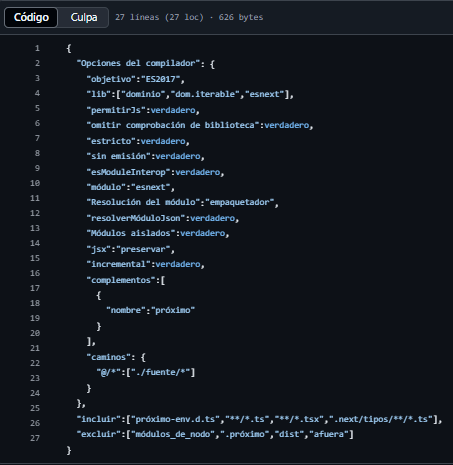
## Resumen del archivo `tsconfig.json`

Este archivo configura el compilador de TypeScript para un proyecto Next.js moderno.

---

### `compilerOptions`

Define opciones del compilador de TypeScript:

- **`target: "ES2017"`**  
  Compila a JavaScript compatible con ES2017.

- **`lib: ["dom", "dom.iterable", "esnext"]`**  
  Incluye definiciones para APIs modernas del navegador y ESNext.

- **`allowJs: true`**  
  Permite incluir archivos `.js` junto con `.ts`.

- **`skipLibCheck: true`**  
  Omite la verificación de tipos en los archivos `.d.ts` de dependencias.

- **`strict: true`**  
  Habilita todas las opciones estrictas de comprobación de tipos.

- **`noEmit: true`**  
  Evita que TypeScript genere archivos `.js`.

- **`esModuleInterop: true`**  
  Permite interoperabilidad con módulos CommonJS (`require`/`import`).

- **`module: "esnext"`**  
  Usa la sintaxis de módulos más reciente.

- **`moduleResolution: "bundler"`**  
  Optimiza la resolución de módulos para herramientas modernas como Turbopack.

- **`resolveJsonModule: true`**  
  Permite importar archivos `.json` como módulos.

- **`isolatedModules: true`**  
  Requiere que cada archivo sea tratable como un módulo independiente (útil para compiladores como Babel).

- **`jsx: "preserve"`**  
  Mantiene el JSX sin transformar (Next.js lo transforma).

- **`incremental: true`**  
  Habilita compilación incremental para mejorar tiempos de build.

- **`plugins: [{ name: "next" }]`**  
  Integra soporte especial para proyectos Next.js.

- **`paths: { "@/*": ["./src/*"] }`**  
  Alias para importar rutas internas desde `src/` usando `@/`.

---

### `include`

- Archivos incluidos para análisis:
  - `next-env.d.ts`: definición de tipos de Next.js.
  - Todos los archivos `.ts` y `.tsx`.
  - Tipos generados en `.next/types`.

---

### `exclude`

- Directorios excluidos:
  - `node_modules`: dependencias externas.
  - `.next`: archivos temporales de Next.js.
  - `dist` y `out`: salidas de producción o build manual.

---

### Propósito

Esta configuración proporciona un entorno robusto y estricto para desarrollar aplicaciones Next.js con TypeScript, asegurando compatibilidad moderna, uso eficiente de módulos, y una experiencia optimizada para desarrolladores.

## Resumen del archivo `tsconfig.json`

Este archivo configura el compilador de TypeScript para un proyecto Next.js moderno.

---

### `compilerOptions`

Define opciones del compilador de TypeScript:

- **`target: "ES2017"`**  
  Compila a JavaScript compatible con ES2017.

- **`lib: ["dom", "dom.iterable", "esnext"]`**  
  Incluye definiciones para APIs modernas del navegador y ESNext.

- **`allowJs: true`**  
  Permite incluir archivos `.js` junto con `.ts`.

- **`skipLibCheck: true`**  
  Omite la verificación de tipos en los archivos `.d.ts` de dependencias.

- **`strict: true`**  
  Habilita todas las opciones estrictas de comprobación de tipos.

- **`noEmit: true`**  
  Evita que TypeScript genere archivos `.js`.

- **`esModuleInterop: true`**  
  Permite interoperabilidad con módulos CommonJS (`require`/`import`).

- **`module: "esnext"`**  
  Usa la sintaxis de módulos más reciente.

- **`moduleResolution: "bundler"`**  
  Optimiza la resolución de módulos para herramientas modernas como Turbopack.

- **`resolveJsonModule: true`**  
  Permite importar archivos `.json` como módulos.

- **`isolatedModules: true`**  
  Requiere que cada archivo sea tratable como un módulo independiente (útil para compiladores como Babel).

- **`jsx: "preserve"`**  
  Mantiene el JSX sin transformar (Next.js lo transforma).

- **`incremental: true`**  
  Habilita compilación incremental para mejorar tiempos de build.

- **`plugins: [{ name: "next" }]`**  
  Integra soporte especial para proyectos Next.js.

- **`paths: { "@/*": ["./src/*"] }`**  
  Alias para importar rutas internas desde `src/` usando `@/`.

---

### `include`

- Archivos incluidos para análisis:
  - `next-env.d.ts`: definición de tipos de Next.js.
  - Todos los archivos `.ts` y `.tsx`.
  - Tipos generados en `.next/types`.

---

### `exclude`

- Directorios excluidos:
  - `node_modules`: dependencias externas.
  - `.next`: archivos temporales de Next.js.
  - `dist` y `out`: salidas de producción o build manual.

---

### Propósito

Esta configuración proporciona un entorno robusto y estricto para desarrollar aplicaciones Next.js con TypeScript, asegurando compatibilidad moderna, uso eficiente de módulos, y una experiencia optimizada para desarrolladores.

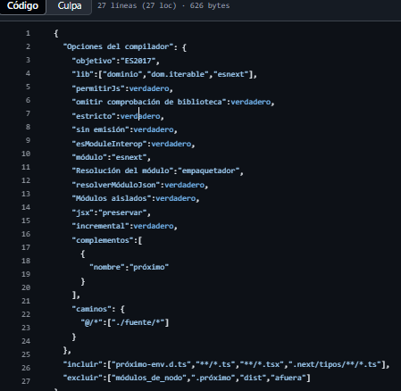
## Resumen del archivo `tsconfig.json`

Este archivo configura el compilador de TypeScript para un proyecto Next.js moderno.

---

### `compilerOptions`

Define opciones del compilador de TypeScript:

- **`target: "ES2017"`**  
  Compila a JavaScript compatible con ES2017.

- **`lib: ["dom", "dom.iterable", "esnext"]`**  
  Incluye definiciones para APIs modernas del navegador y ESNext.

- **`allowJs: true`**  
  Permite incluir archivos `.js` junto con `.ts`.

- **`skipLibCheck: true`**  
  Omite la verificación de tipos en los archivos `.d.ts` de dependencias.

- **`strict: true`**  
  Habilita todas las opciones estrictas de comprobación de tipos.

- **`noEmit: true`**  
  Evita que TypeScript genere archivos `.js`.

- **`esModuleInterop: true`**  
  Permite interoperabilidad con módulos CommonJS (`require`/`import`).

- **`module: "esnext"`**  
  Usa la sintaxis de módulos más reciente.

- **`moduleResolution: "bundler"`**  
  Optimiza la resolución de módulos para herramientas modernas como Turbopack.

- **`resolveJsonModule: true`**  
  Permite importar archivos `.json` como módulos.

- **`isolatedModules: true`**  
  Requiere que cada archivo sea tratable como un módulo independiente (útil para compiladores como Babel).

- **`jsx: "preserve"`**  
  Mantiene el JSX sin transformar (Next.js lo transforma).

- **`incremental: true`**  
  Habilita compilación incremental para mejorar tiempos de build.

- **`plugins: [{ name: "next" }]`**  
  Integra soporte especial para proyectos Next.js.

- **`paths: { "@/*": ["./src/*"] }`**  
  Alias para importar rutas internas desde `src/` usando `@/`.

---

### `include`

- Archivos incluidos para análisis:
  - `next-env.d.ts`: definición de tipos de Next.js.
  - Todos los archivos `.ts` y `.tsx`.
  - Tipos generados en `.next/types`.

---

### `exclude`

- Directorios excluidos:
  - `node_modules`: dependencias externas.
  - `.next`: archivos temporales de Next.js.
  - `dist` y `out`: salidas de producción o build manual.

---

### Propósito

Esta configuración proporciona un entorno robusto y estricto para desarrollar aplicaciones Next.js con TypeScript, asegurando compatibilidad moderna, uso eficiente de módulos, y una experiencia optimizada para desarrolladores.

## IMPLEMENTACION DE MONGOD

**SER CREO LAS COLECCIONES CORRESPONDIDAS**

**Y Se crearon con la Estructura recomendada**
**Lecturas_sensores:**  
- hora_fecha: 2025-06-26T17:00:00Z  
- iluminacion: 300  
- temperatura: 25.4  
- (otros campos posibles)

**Estadisticas_resultados:**  
- hora_fecha: 2025-06-26T17:00:00Z  
- sensorDe: temperatura  
- media: 24.8  
- varianza: 0.6  

**Predicciones:**  
- hora_fecha: 2025-06-26T17:00:00Z  
- sensorDe: iluminacion  
- mediaMovil: 295.3  
- suavizado: 298.1  

**Alertas:**  
- hora_fecha: 2025-06-26T17:00:00Z  
- sensorDe: temperatura  
- valor: 35.0  
**La Base de Datos se llama "principal"**

**Coleccion Alerta**
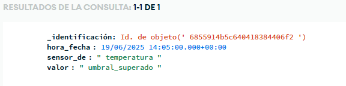
**Coleccion Estadistica_Resultado**
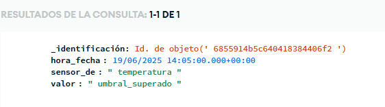
**Coleccion lectura_sensores**
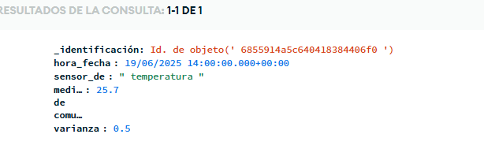
**Resultado Predicciones**
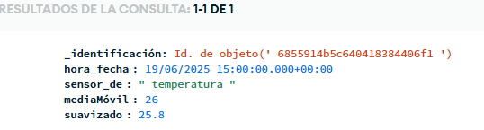

### CONEXION A MONGO
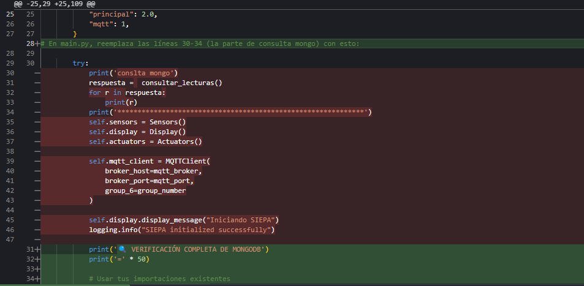
## Resumen del Bloque de Código en `main.py`

Se reemplazan las líneas 30-34 por un bloque que realiza una verificación completa de MongoDB con los siguientes pasos:

1. **Mensajes de inicio**  
   - Se indica que se está verificando la conexión y estructura de MongoDB.

2. **Importaciones necesarias**  
   - Se importan `client` y `db` desde el módulo `mongodb`.

3. **Consulta de lecturas**  
   - Se invoca la función `consultar_lecturas(cantidad=10)`.
   - Se imprime cuántos registros fueron encontrados.

4. **Verificación de colecciones**  
   - Se listan las colecciones disponibles en la base de datos.
   - Se imprime el nombre de cada colección junto con la cantidad de documentos que contiene.

5. **Detalles específicos de `lecturas_sensores`**  
   - Se cuenta el total de documentos en dicha colección.
   - Si hay documentos, se:
     - Muestra la estructura (campos) del primer documento.
     - Muestran los últimos 5 registros con detalle:
       - Fecha
       - Temperatura
       - Humedad
       - Iluminación
       - Presión
       - Calidad del aire
       - Distancia


# ESTADISTICAS ARM
#### MENU DE ESTADISTICAS
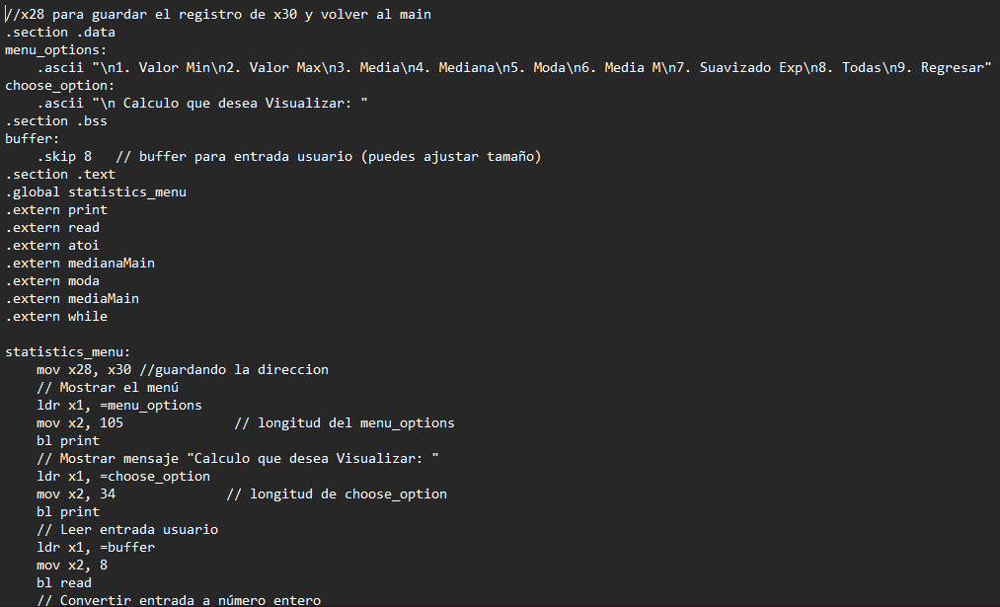
# Resumen del Código Assembly: `statistics_menu`

## Secciones del Código

### `.data`
- **menu_options**: Contiene el texto del menú que se mostrará al usuario.
- **choose_option**: Mensaje que solicita al usuario que seleccione una opción.

### `.bss`
- **buffer**: Espacio reservado para almacenar la entrada del usuario (8 bytes).

### `.text`
- **statistics_menu**: Función principal que despliega el menú y responde a la selección del usuario.

## Funcionalidad General

1. Guarda la dirección de retorno (`x30`) en `x28` para poder volver al `main`.
2. Muestra el menú (`menu_options`) y un mensaje para elegir una opción (`choose_option`).
3. Lee la entrada del usuario y la convierte a número entero usando `atoi`.
4. Según el valor ingresado (`x0`), llama a distintas funciones:
    - `3`: llama a `mediaMain`
    - `4`: llama a `medianaMain`
    - `5`: llama a `moda`
    - `9`: finaliza el menú y retorna al main

5. Si la opción no es válida, el menú se muestra de nuevo en un bucle.

## Funciones Externas Llamadas

- `print`: Imprimir cadenas de texto.
- `read`: Leer entrada del usuario.
- `atoi`: Convertir texto a entero.
- `mediaMain`, `medianaMain`, `moda`: Funciones de cálculo estadístico.
- `while`: Declarada como externa pero no utilizada en este fragmento.

## Observaciones

- Las opciones `1`, `2`, `6`, `7`, `8` están en el menú pero no están implementadas en el flujo lógico.
- El programa es cíclico hasta que se elige la opción `9`.

### MAX TERMINOS
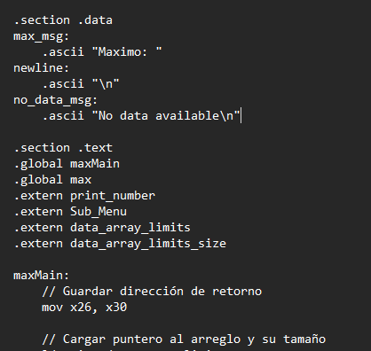
# Resumen del Código Assembly: `maxMain` y `max`

## Secciones del Código

### `.data`
- **max_msg**: Mensaje `"Maximo: "` para mostrar antes del resultado.
- **newline**: Caracter de nueva línea `\n`.
- **no_data_msg**: Mensaje de error `"No data available\n"`.

### `.text`
- **Funciones Definidas**:
  - `maxMain`: Función principal que calcula y muestra el valor máximo.
  - `max`: Función auxiliar que calcula el valor máximo en un arreglo.

- **Funciones Externas**:
  - `print_number`: Imprime un número.
  - `Sub_Menu`: Punto de retorno después del cálculo.
  - `data_array_limits`: Dirección del arreglo de datos.
  - `data_array_limits_size`: Tamaño del arreglo.

## Lógica de `maxMain`

1. Guarda la dirección de retorno en `x26`.
2. Carga el puntero al arreglo y su tamaño desde memoria.
3. Si el arreglo está vacío (`w2 == 0`), salta a `.no_data`.
4. Llama a la función `max` para calcular el valor máximo.
5. Guarda el resultado en `x10`.
6. Imprime el mensaje `"Maximo: "`.
7. Imprime el número calculado usando `print_number`.
8. Imprime un salto de línea.
9. Devuelve el valor en `x0` y retorna al submenú.

### Caso `.no_data`
- Muestra el mensaje `"No data available\n"` si el arreglo tiene tamaño cero y retorna.

## Lógica de la Función `max`

- **Entrada**:
  - `x1`: Puntero al arreglo.
  - `w2`: Tamaño del arreglo.

- **Proceso**:
  1. Verifica si el arreglo está vacío. Si es así, retorna 0.
  2. Inicializa el valor máximo (`x0`) con el primer elemento del arreglo.
  3. Itera por el resto del arreglo:
     - Compara cada elemento con el actual máximo.
     - Si es mayor, actualiza el valor máximo.
  4. Finaliza y retorna el valor máximo en `x0`.

## Consideraciones

- Usa registros de 64 bits (`x1`, `x2`, `x3`, `x4`) para manejar direcciones y datos.
- El tamaño del arreglo está en 32 bits (`w2`), pero se extiende implícitamente para comparación.
- El código está preparado para evitar errores si el arreglo tiene cero o un solo elemento.

### MEDIA
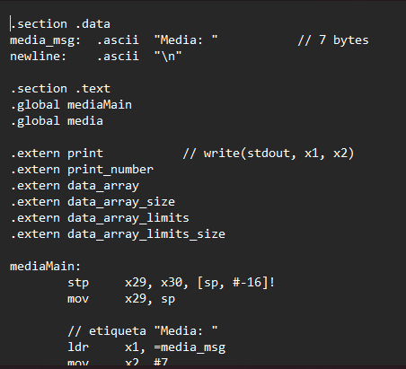
# Resumen del Código Assembly: `mediaMain` y `media`

## Secciones del Código

### `.data`
- **media_msg**: Texto `"Media: "` usado como encabezado.
- **newline**: Caracter de nueva línea `\n`.

### `.text`
- **Funciones Globales**:
  - `mediaMain`: Función principal que calcula e imprime la media.
  - `media`: Función auxiliar que calcula la media aritmética de un arreglo.

- **Funciones Externas**:
  - `print`: Imprime texto.
  - `print_number`: Imprime un número.
  - `data_array_limits`: Dirección del arreglo de datos.
  - `data_array_limits_size`: Tamaño del arreglo.

## Lógica de `mediaMain`

1. Guarda los registros de enlace y marco (`x29`, `x30`) en la pila.
2. Imprime la etiqueta `"Media: "` usando `print`.
3. Carga el puntero al arreglo y su tamaño desde `data_array_limits` y `data_array_limits_size`.
4. Llama a la función `media` con esos argumentos.
5. Guarda el resultado en `x10` antes de imprimir el número.
6. Llama a `print_number` para mostrar el valor de la media.
7. Imprime un salto de línea (`\n`) usando `svc` (llamada al sistema).
8. Restaura el resultado en `x0` y los registros desde la pila.
9. Retorna.

## Lógica de la Función `media`

- **Entrada**:
  - `x1`: Puntero al arreglo.
  - `w2`: Tamaño del arreglo (número de elementos).

- **Proceso**:
  1. Si el tamaño es cero, retorna 0.
  2. Inicializa:
     - `x3` como acumulador de la suma.
     - `w4` como índice del ciclo.
  3. Itera sobre el arreglo:
     - Suma cada elemento a `x3`.
     - Incrementa el índice.
  4. Convierte `w2` a 64 bits (`x6`) y divide `x3` entre `x6` para obtener la media.
  5. Retorna el valor de la media en `x0`.

## Consideraciones

- La media se calcula con división entera (sin decimales).
- Usa registros de 64 bits para la suma y la división para evitar desbordamientos.
- Tiene protección básica contra arreglos vacíos (retorna 0 si el tamaño es cero).
- Se usa `stp/ldp` y `mov` para manejo del stack frame correctamente.


### MEDIANA 
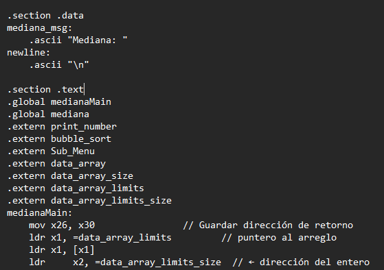
# Resumen del Código Assembly: `medianaMain` y `mediana`

## Secciones del Código

### `.data`
- **mediana_msg**: Texto `"Mediana: "` que se muestra antes del resultado.
- **newline**: Caracter de nueva línea `\n`.

### `.text`
- **Funciones Globales**:
  - `medianaMain`: Función principal que ordena el arreglo, calcula e imprime la mediana.
  - `mediana`: Función auxiliar que calcula la mediana de un arreglo ordenado.

- **Funciones Externas**:
  - `print_number`: Imprime un número.
  - `bubble_sort`: Ordena el arreglo (método externo invocado antes del cálculo).
  - `Sub_Menu`: Retorno al submenú (no usado explícitamente en este código).
  - `data_array_limits`, `data_array_limits_size`: Puntero al arreglo y su tamaño.

## Lógica de `medianaMain`

1. Guarda la dirección de retorno en `x26`.
2. Carga el puntero al arreglo y su tamaño desde memoria.
3. Llama a `bubble_sort` para ordenar el arreglo.
4. Llama a la función `mediana` para calcular el valor central.
5. Guarda el resultado en `x10`.
6. Imprime el texto `"Mediana: "` usando `svc`.
7. Imprime el valor calculado con `print_number`.
8. Imprime un salto de línea (`\n`).
9. Restaura el valor en `x0` y retorna al programa principal.

## Lógica de la Función `mediana`

- **Entrada**:
  - `x1`: Puntero al arreglo ordenado.
  - `w2`: Tamaño del arreglo.

- **Proceso**:
  1. Si el tamaño es cero (`w2 == 0`), retorna 0.
  2. Calcula el índice medio (`w3 = w2 / 2`) y si el tamaño es impar o par (`w4 = w2 % 2`).
  3. Si es **par**:
     - Obtiene los dos valores centrales.
     - Calcula su promedio entero (sin decimales) y lo coloca en `x0`.
  4. Si es **impar**:
     - Devuelve el valor central directamente.
  5. Finaliza en `.done`.

## Consideraciones

- El arreglo debe estar previamente ordenado (por eso se llama a `bubble_sort`).
- La mediana se calcula con división entera si hay dos elementos centrales (truncando decimales).
- Hay protección contra arreglos vacíos (retorna 0).
- Uso adecuado de registros extendidos (`uxtw`, `lsr`) para manejar conversión entre 32 y 64 bits.

### MIN TERMINOS 
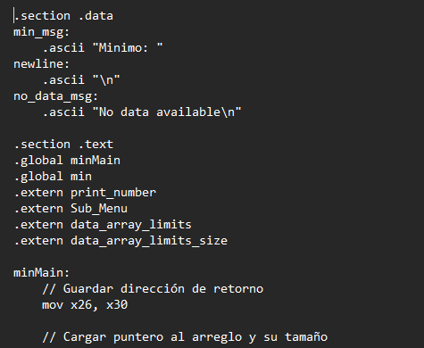
# Resumen del Código Assembly: `minMain` y `min`

## Secciones del Código

### `.data`
- **min_msg**: Texto `"Minimo: "` que se imprime antes del resultado.
- **newline**: Caracter de nueva línea `\n`.
- **no_data_msg**: Mensaje de error `"No data available\n"` cuando el arreglo está vacío.

### `.text`
- **Funciones Globales**:
  - `minMain`: Función principal que calcula e imprime el valor mínimo.
  - `min`: Función auxiliar que encuentra el valor mínimo en un arreglo.

- **Funciones Externas**:
  - `print_number`: Imprime un número en consola.
  - `Sub_Menu`: Función a la que se retorna tras ejecutar.
  - `data_array_limits`: Dirección al arreglo de datos.
  - `data_array_limits_size`: Tamaño del arreglo.

## Lógica de `minMain`

1. Guarda la dirección de retorno en `x26`.
2. Carga el puntero al arreglo y su tamaño.
3. Si el tamaño es cero (`w2 == 0`), muestra mensaje de error (`no_data_msg`) y salta a `Sub_Menu`.
4. Llama a la función `min` para obtener el menor valor del arreglo.
5. Imprime `"Minimo: "` con llamada al sistema (`svc`).
6. Imprime el número mínimo con `print_number`.
7. Imprime un salto de línea (`\n`) con `svc`.
8. Restaura la dirección de retorno (`x30`) y vuelve al submenú.

## Lógica de la Función `min`

- **Entrada**:
  - `x1`: Puntero al arreglo.
  - `w2`: Tamaño del arreglo.

- **Proceso**:
  1. Si el arreglo está vacío, retorna 0 (`.empty_array`).
  2. Inicializa `x0` con el primer elemento del arreglo.
  3. Itera sobre los elementos desde el índice 1:
     - Compara cada elemento con el actual mínimo.
     - Si es menor, actualiza el mínimo.
  4. Termina el ciclo al alcanzar el final del arreglo y retorna el valor mínimo en `x0`.

## Consideraciones

- La función tiene protección contra arreglos vacíos.
- Usa registros de 64 bits para el recorrido (`x3` y `x4`).
- El acceso a los elementos se realiza con desplazamientos de 8 bytes (`lsl #3`) asumiendo enteros de 64 bits.
- El mensaje de error y el retorno al submenú están gestionados si no hay datos.

## MODA
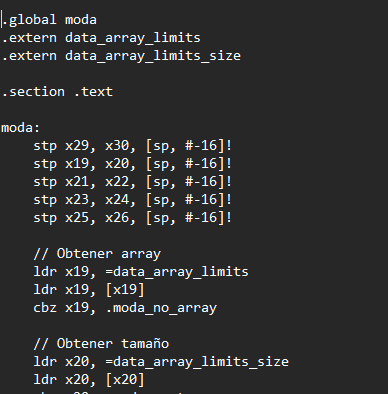
# Resumen del Código Assembly: `moda` y `convert_and_print`

## Secciones del Código

### `.data`
- `moda_result_msg`: Texto `"Moda: "` (6 bytes).

### `.bss`
- `char_buffer`: Buffer de 2 bytes (no utilizado explícitamente).
- `number_buffer`: Buffer de 20 bytes para imprimir números convertidos.
- `temp_digits`: Buffer temporal para extraer dígitos numéricos.

---

## Función: `moda`

### Propósito
Calcula la moda (valor más frecuente) en un arreglo de enteros.

### Entrada
- Usa `data_array_limits` y `data_array_limits_size` para acceder al arreglo y su tamaño.

### Variables usadas
- `x19`: Puntero al arreglo.
- `x20`: Tamaño del arreglo.
- `x21`: Valor de la moda encontrado.
- `x22`: Frecuencia máxima hasta el momento.
- `x23`: Índice del bucle externo.
- `x24`: Valor actual que se cuenta.
- `x25`: Contador de apariciones.
- `x26`: Índice del bucle interno.

### Algoritmo
1. **Validación inicial**:
   - Si el puntero al arreglo o el tamaño son cero, sale sin hacer nada.

2. **Bucle doble (anidado)**:
   - Para cada elemento del arreglo (`x24`):
     - Cuenta cuántas veces aparece en todo el arreglo.
     - Si su frecuencia (`x25`) es mayor que la actual máxima (`x22`), actualiza la moda (`x21`).

3. **Resultado**:
   - Si hay al menos un elemento, imprime `"Moda: "` y llama a `convert_and_print` para mostrar el número.

---

## Función: `convert_and_print`

### Propósito
Convierte un entero a string en ASCII y lo imprime usando syscall `write`.

### Entrada
- `x0`: Número a convertir e imprimir.

### Proceso
1. **Manejo de cero**:
   - Si el número es 0, escribe directamente `'0'`.

2. **Conversión de número positivo o negativo**:
   - Si es negativo, escribe el signo `'-'` y convierte el valor absoluto.
   - Usa divisiones sucesivas por 10 para extraer los dígitos.
   - Guarda los dígitos invertidos en `temp_digits`.

3. **Copiado e impresión**:
   - Copia los dígitos en orden correcto al buffer `number_buffer`.
   - Usa syscall `svc 0` con código `64` para imprimir el número convertido.

---

## Consideraciones

- **Complejidad**: Algoritmo de moda con complejidad O(n²), poco eficiente para arreglos grandes.
- **Resguardo de registros**: Usa `stp` y `ldp` para preservar y restaurar registros (buena práctica).
- **Uso de syscall**: Se realiza escritura directamente a `stdout` (descriptor 1).
- **Formato de impresión**: Mensajes y número se imprimen en consola como texto.

---

## Casos manejados

- Arreglo vacío → no imprime nada.
- Moda única → se muestra.
- Varios valores con misma frecuencia → solo se conserva el primero encontrado.

## SUAVIZADO
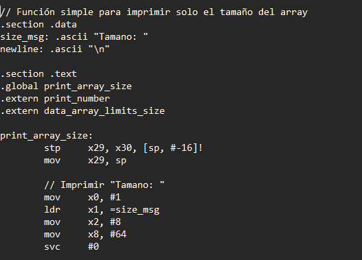
# Función: `print_array_size`

## Propósito
Imprime el mensaje `"Tamano: "` seguido del número de elementos del arreglo (`data_array_limits_size`) y un salto de línea.

---

## Secciones de Datos

### `.data`
- `size_msg`: Contiene `"Tamano: "` (8 bytes).
- `newline`: Contiene `"\n"` (1 byte).

---

## Implementación

### Proceso Paso a Paso

1. **Guardar registros de marco**
   ```asm
   stp x29, x30, [sp, #-16]!
   mov x29, sp

## VARIANZA
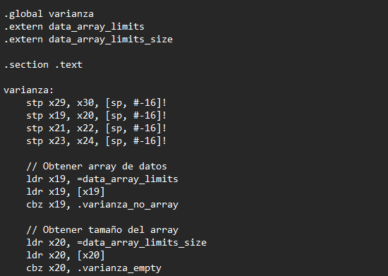
# Función: `varianza`

## Propósito
Calcula e imprime la **varianza** de un arreglo de enteros almacenado externamente en `data_array_limits` y cuyo tamaño se encuentra en `data_array_limits_size`.

---

## Secciones de Datos

``asm
.section .data
varianza_result_msg: .ascii "\nVarianza: "

.section .bss
output_buffer: .space 32

## MEDIA MOVIL 
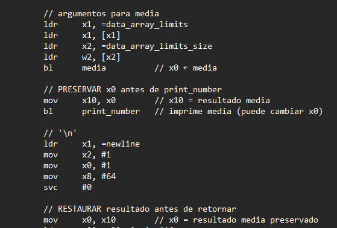
# Resumen del Código Assembly: `mediaMain` y `media`

## Secciones del Código

### `.data`
- **media_msg**: Texto `"Media: "` usado como encabezado.
- **newline**: Caracter de nueva línea `\n`.

### `.text`
- **Funciones Globales**:
  - `mediaMain`: Función principal que calcula e imprime la media.
  - `media`: Función auxiliar que calcula la media aritmética de un arreglo.

- **Funciones Externas**:
  - `print`: Imprime texto.
  - `print_number`: Imprime un número.
  - `data_array_limits`: Dirección del arreglo de datos.
  - `data_array_limits_size`: Tamaño del arreglo.

## Lógica de `mediaMain`

1. Guarda los registros de enlace y marco (`x29`, `x30`) en la pila.
2. Imprime la etiqueta `"Media: "` usando `print`.
3. Carga el puntero al arreglo y su tamaño desde `data_array_limits` y `data_array_limits_size`.
4. Llama a la función `media` con esos argumentos.
5. Guarda el resultado en `x10` antes de imprimir el número.
6. Llama a `print_number` para mostrar el valor de la media.
7. Imprime un salto de línea (`\n`) usando `svc` (llamada al sistema).
8. Restaura el resultado en `x0` y los registros desde la pila.
9. Retorna.

## Lógica de la Función `media`

- **Entrada**:
  - `x1`: Puntero al arreglo.
  - `w2`: Tamaño del arreglo (número de elementos).

- **Proceso**:
  1. Si el tamaño es cero, retorna 0.
  2. Inicializa:
     - `x3` como acumulador de la suma.
     - `w4` como índice del ciclo.
  3. Itera sobre el arreglo:
     - Suma cada elemento a `x3`.
     - Incrementa el índice.
  4. Convierte `w2` a 64 bits (`x6`) y divide `x3` entre `x6` para obtener la media.
  5. Retorna el valor de la media en `x0`.

## Consideraciones

- La media se calcula con división entera (sin decimales).
- Usa registros de 64 bits para la suma y la división para evitar desbordamientos.
- Tiene protección básica contra arreglos vacíos (retorna 0 si el tamaño es cero).
- Se usa `stp/ldp` y `mov` para manejo del stack frame correctamente.

# PARTE DE PROYECTO 
## ATOI 
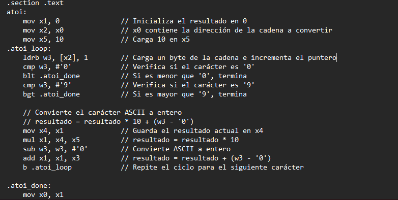
# Función: `atoi`

## Propósito
Convierte una cadena de caracteres (`char*`) que representa un número decimal (en ASCII) en su valor entero (base 10). Similar a `atoi` en C.

---

## Firma esperada

``c
int atoi(const char *str);

## ATOI PARCIAL
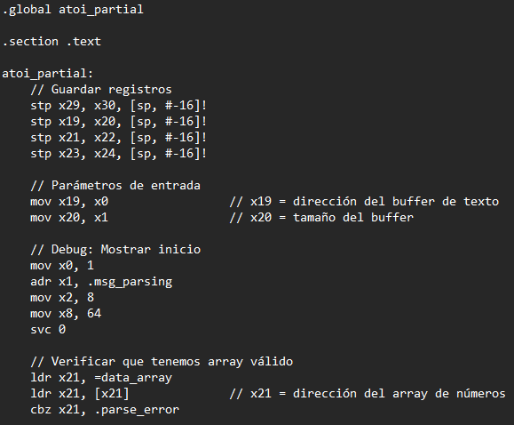
# Función: `atoi_partial`

## Propósito

Parsea un buffer de texto que contiene números ASCII separados por saltos de línea (`\n`) y los convierte a enteros, almacenándolos en un array global. Detecta si el texto contiene un terminador especial (`$`) para señalar fin de entrada.

---

## Firma esperada

``c
int atoi_partial(char* buffer, int size);

### BLUE_SORT
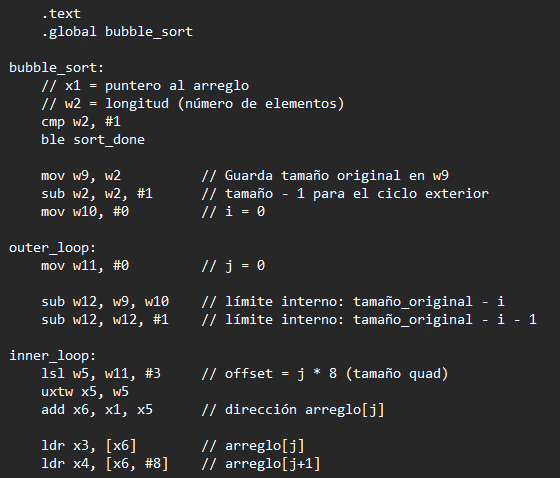
# Función: `bubble_sort`

## Propósito

Ordena un arreglo de enteros de 64 bits (`int64_t`) en orden ascendente utilizando el algoritmo de **Bubble Sort**.

---

## Firma esperada

``c
void bubble_sort(int64_t* array, int size);

### COUNT_PARTIAL.S
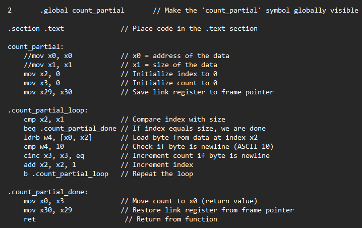
## Resumen del código ARM64: `count_partial`

Este fragmento de código en ensamblador ARM64 implementa una función llamada `count_partial` que cuenta cuántas veces aparece el carácter de nueva línea (ASCII 10) en un bloque de datos.

### Secciones del código

- `.global count_partial`: Declara el símbolo `count_partial` como global para que pueda ser utilizado desde otros archivos.
- `.section .text`: Indica que el código debe colocarse en la sección de texto, donde se almacenan las instrucciones ejecutables.

### Funcionamiento de `count_partial`

#### Propósito
Contar el número de caracteres de nueva línea (`\n`, ASCII 10) en una cadena de bytes.

#### Parámetros de entrada
- `x0`: Dirección del bloque de datos.
- `x1`: Tamaño del bloque (número de bytes).

#### Variables internas
- `x2`: Índice actual (inicializado en 0).
- `x3`: Contador de caracteres de nueva línea (inicializado en 0).
- `x29`, `x30`: Se utilizan para guardar y restaurar el registro de enlace.

#### Lógica del bucle principal (`.count_partial_loop`)
1. Compara el índice `x2` con el tamaño `x1`. Si son iguales, termina el bucle.
2. Carga un byte desde la posición `[x0 + x2]` y lo guarda en `w4`.
3. Compara el valor cargado con 10 (ASCII de nueva línea).
4. Si es igual, incrementa `x3`.
5. Incrementa el índice `x2` y repite el bucle.

#### Finalización (`.count_partial_done`)
- El resultado final (el contador `x3`) se mueve a `x0` como valor de retorno.
- Se restaura el registro de enlace (`x30`) y se retorna de la función.

## EXPORTACION A XML
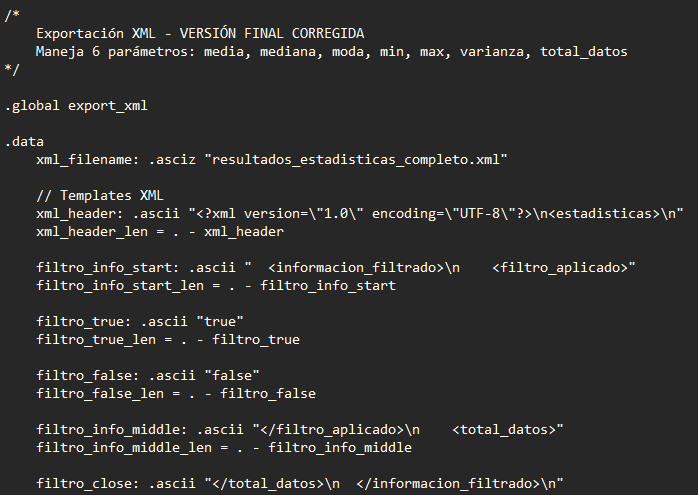
## Resumen del código ensamblador ARM64: `export_xml`

Este fragmento implementa una función que genera un archivo XML con estadísticas (media, mediana, moda, mínimo, máximo, varianza, total de datos).

---

### 🔹 Definiciones de datos

- Nombre del archivo XML y plantillas para encabezado, etiquetas de filtro, estadísticas y contenido por defecto ("No calculado").
- Espacio reservado para convertir números (`number_buffer`).

---

### 🔹 Función `export_xml`

**Parámetros (registros x0–x6):**
- `x0`: media (−1 si no calculada)  
- `x1`: mediana  
- `x2`: moda  
- `x3`: mínimo  
- `x4`: máximo  
- `x5`: varianza  
- `x6`: total de datos

**Flujo principal:**
1. Respalda registros y guarda parámetros (`x19–x25`).
2. Abre/crea el archivo XML con `openat`, conservando el descriptor en `x26`.
3. Escribe el encabezado XML.
4. Compara `total_datos` con el tamaño original (`data_array_size`) para determinar si ocurrió filtrado.
   - Si hubo filtrado → escribe `true`; si no → escribe `false`.
5. Escribe el bloque `<informacion_filtrado>` con filtro y total real.
6. Escribe el nodo `<resultados_estadisticos>`.
7. Para cada estadística (media, mediana, moda, mínimo, máximo, varianza):
   - Escribe etiqueta de apertura.
   - Si el valor es −1 → escribe "No calculado"; si no → convierte valor numérico a cadena y escribe su contenido.
   - Escribe etiqueta de cierre correspondiente.
8. Cierra la sección de estadísticas y la etiqueta raíz.
9. Cierra el archivo y muestra mensaje de éxito.
10. En caso de error al abrir archivo → devuelve −1, restaurando registros.

---

### 🔹 Subrutinas auxiliares

#### `number_to_string`
Convierte valor entero (`x0`) a cadena ASCII en `number_buffer`:
- Limpia el buffer.
- Si el número es 0 → escribe `"0"`.
- Si es >0:
  - Extrae dígitos en orden inverso.
  - Luego invierte la cadena para dejar el número correcto.

#### `string_length`
Calcula longitud de cadena (`x1`) contando hasta el byte nulo (`0x00`) y devuelve la longitud en `x0`.

---

### 🔹 Resultado

– En ejecución exitosa: retorna `0` y se genera `resultados_estadisticas_completo.xml` incluyendo estadísticas calculadas o "No calculado".  
– En fallo (e.g., no se abre el archivo): retorna `−1`.

---

### 📝 Notas

- Usa llamadas a sistema (`svc #0`) para escritura (syscall 64), apertura (56) y cierre (57) de archivos.
- Conserva el estado del registro de enlace (`x29`, `x30`) y registros usados (`x19–x25`).
- Evita duplicar el código usando subrutinas para conversión y cálculo de longitud.

# MAIN
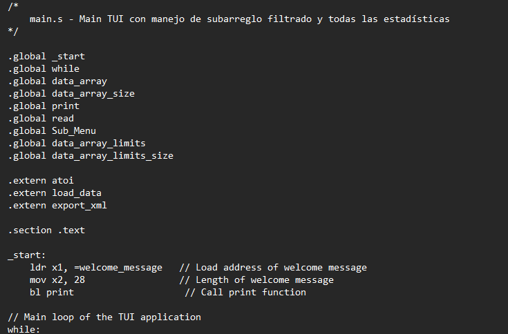
# 🧠 Resumen del Código Assembly (`main.s`)

Este archivo contiene la **interfaz de usuario principal (TUI)** para una aplicación que realiza análisis estadísticos y exportación de resultados en XML. A continuación, se describe brevemente su estructura y funcionalidades.

---

## 📂 Estructura General

- **Archivo principal:** `main.s`
- **Lenguaje:** ARMv8 Assembly (AArch64)
- **Funciones externas utilizadas:**
  - `atoi`: Conversión de texto a número
  - `load_data`: Cargar datos desde archivo
  - `export_xml`: Exportar resultados a archivo XML

---

## 🧭 Flujo Principal (`_start` y `while`)

1. Muestra mensaje de bienvenida.
2. Entra en un bucle (`while`) que presenta un **menú principal** con 6 opciones:
   1. Ver estadísticas
   2. Predicciones
   3. Seleccionar archivo
   4. Establecer límites de subarreglo
   5. Exportar resultados a XML
   6. Salir

---

## 🧮 Estadísticas (`Sub_Menu`)

Opciones disponibles:
1. Mínimo
2. Máximo
3. Media
4. Mediana
5. Moda
6. Varianza
8. Calcular todas
9. Regresar

Cada función guarda su resultado en una dirección de memoria específica (`resultado_*`) y marca como calculada con una bandera (`*_calculado`).

---

## 🔮 Predicciones (`predictions`)

Opciones disponibles:
1. Suavizado
2. Media móvil (no implementada aún)
3. Volver al menú principal

---

## 📁 Archivos y Datos

- `set_file`: Permite ingresar un nombre de archivo para cargar datos mediante `load_data`.
- `set_limits`: Define un subarreglo mediante índices de inicio y fin. Si ambos son 0, se usan todos los datos.

---

## 🧾 Exportación XML (`exportar_xml`)

Se exportan los valores calculados (media, mediana, moda, min, max, varianza) usando la función `export_xml`.

---

## 🛑 Finalización

- `end`: Muestra un mensaje de despedida y finaliza el programa.
- Manejo de errores: Muestra mensajes si la opción ingresada no es válida o si los límites del subarreglo no son correctos.

---

## 🛠 Funciones Auxiliares

- `print`: Imprime texto al stdout.
- `read`: Lee texto del stdin.
- `atoi`: Convierte cadena numérica a entero.
- `bl <func>`: Llamadas a funciones internas y externas.

---

## 🧾 Memoria Usada

Variables globales usadas para almacenar resultados:
- `resultado_min`, `resultado_max`, `resultado_media`, `resultado_mediana`, `resultado_moda`, `resultado_varianza`
- Banderas de cálculo: `min_calculado`, `max_calculado`, etc.
- Arreglos: `data_array`, `data_array_limits`

---

## ⚠️ Notas

- El código es extenso y bien modularizado.
- Se apoya en múltiples archivos externos para lógica matemática (`minMain`, `maxMain`, etc.).
- Implementación cuidada de interacción de usuario a bajo nivel (syscalls `svc`).

## GRAFANA

##### DASHBOARDS


#### ESTADISTICAS POR SENSOR


