# Universidad De san carlos
## Facultad de Ingeniería

### Arquitectura de Computadores y Ensambladores 1 Sección A
## Manual De Usuario - Proyecto Único – Fase 1 Sistema Inteligente de Evaluación y Predicción Ambiental
Ing. Luis Fernando Espino
Auxiliar: Josue Guevara
| No | Nombre                                        | Carné     |
|----|-----------------------------------------------|-----------|
| 1  | Derek Francisco Orellana Ibáñez                    | 202001151 |
| 2  | Anguel Jose Miguel Davila Aspuac              | 202300360 |
| 3  | Miguel Angel Kanek Balan Velasco              | 202300765 |
| 4  | Bryan Josue Coronado Lainez            | 202209258 |
| 5  | Edwin Alexander Jax Lopez                     | 202200338 |

Guatemala, 12 de Junio del 2025

# Introducción

En este proyecto se propone el desarrollo de un sistema de monitoreo y riego automatizado, diseñado para maximizar la eficiencia en el consumo de agua y garantizar condiciones ideales para el crecimiento de las plantas. Utilizando tecnologías modernas como una **Raspberry Pi**, **sensores avanzados**, una **Presion** y una **Humedad**, el sistema permite medir variables clave como la **Calidad de Aire** y la **temperatura ambiente** para tomar decisiones automáticas y precisas.

El sistema no solo ajusta la frecuencia y cantidad de riego de manera autónoma, sino que también ofrece a los usuarios la capacidad de **monitorear y controlar** las condiciones desde cualquier lugar mediante una **interfaz intuitiva**. Además, incluye herramientas para gestionar el nivel de agua en el tanque y activar un sistema de ventilación cuando las temperaturas exceden los límites ideales.

Al integrar estas soluciones tecnológicas, el proyecto tiene como objetivo no solo **optimizar la gestión del agua** en sistemas agrícolas, sino también **proporcionar una plataforma educativa** para estudiantes de ingeniería interesados en la implementación de tecnologías innovadoras y sostenibles.

# Objetivos

## General

- Diseñar e implementar un sistema de monitoreo y riego automatizado que utiliza sensores, una Raspberry Pi, y una aplicación móvil para optimizar el uso de agua y controlar las condiciones ambientales de un cultivo de manera eficiente y sostenible.

## Específicos

- Integrar sensores de humedad del suelo, temperatura interna y externa con una Raspberry Pi para la recopilación y procesamiento de datos en tiempo real.
- Diseñar un sistema de riego automatizado que ajuste la frecuencia y cantidad de agua según los datos obtenidos de los sensores.
- Implementar un sistema de ventilación que controle la temperatura del entorno de cultivo, activándose automáticamente al superar los límites preestablecidos.

## Instalacion y Configuracion

**Paso 1:** Instalar las Dependencias
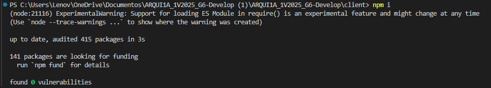
**Paso 2:** Clonar Proyecto
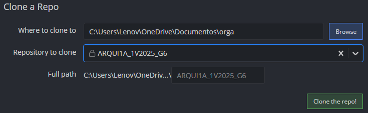
**Paso 3:** Instalar Librerias
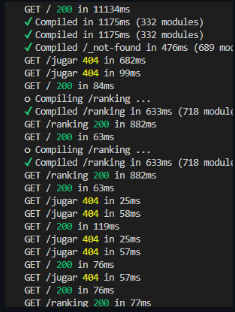
**Paso 4:** Ejecutar el Proyecto
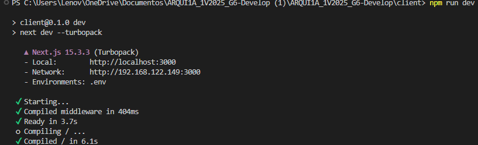

## INICIO DEL PROGRAMA
Al ejecutar el sistema, aparecerá Un Link, En el cual a la hora de dar Click Los lleva atomáticamente a la página de Inicio a la principal http://192.168.148.242:3000/dashboard/historico
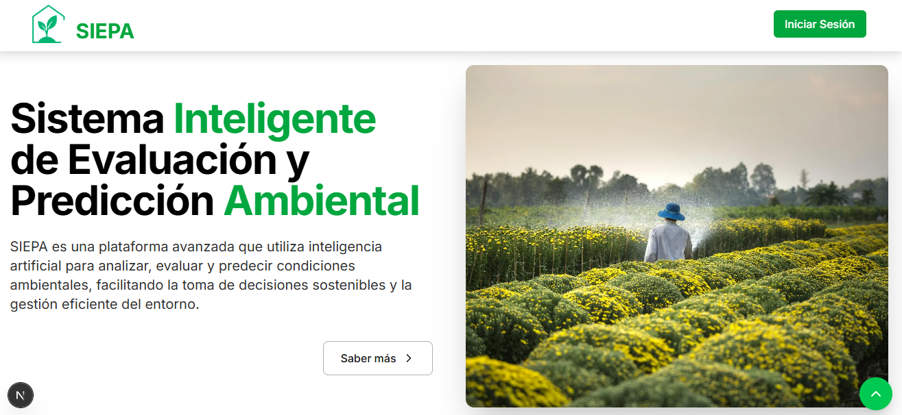
#### LOGO OFICIAL

##### FUNCIONES POTENTES
Nuestra pagina Cuenta con Funciones Potentes, las cuales Podemos verificar a traves de sensores los siguientes datos:
#### TEMPERATURA  
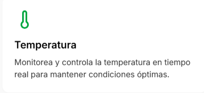
#### HUMEDAD
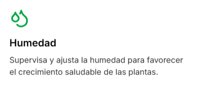
#### MOVIMIENTO 
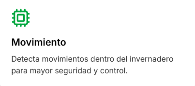
#### ILUMINACION 
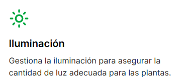
#### PRESION 
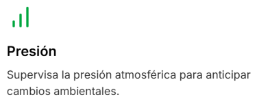
#### DE AIRE (Co2)
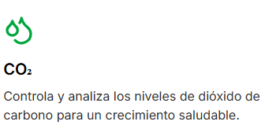

### BOTOS DE INICIO DE SESION
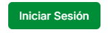
Boton que esta al costado de Nuestra Pagina, Con lo cual a la hora de presionarlo nos lleve directamente a el login de **INICIO DE SESION** la cual esta de esta manera:
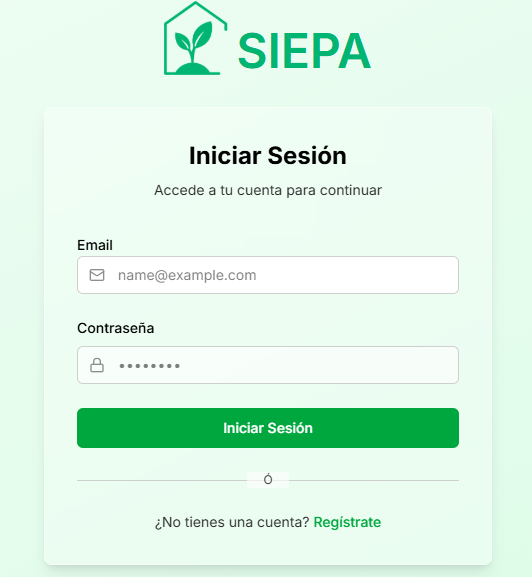
los apartados de Email, y Contraseñar para predeterminar si existe o no un Usuario, pero antes de querer ingresar, primero necesitamos RESGISTRARNOS A SIEPA
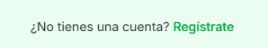
**¿NO TIENES CUENTA?**, Pues tenemos la opcion de registro para todas las edades y para cualquier persona interesada en tener acceso a nuestra Pagina.

**INGRESAMOS CREDENCIALLES**
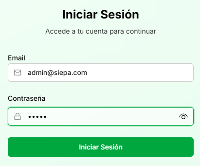
Y una vez ingresamos a la Pagina, veremos esta pestaña, la cual esta Estructura de esta manera:
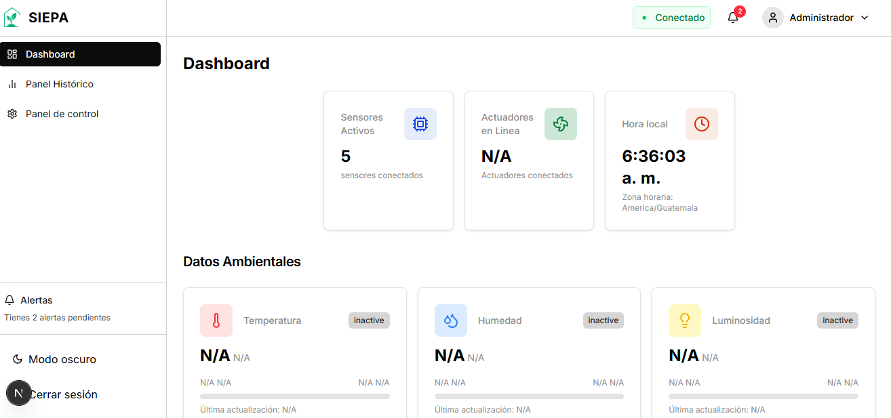

### DASHBOARD

Boton que nos deja en la pestaña principal del programa, con lo cual podemos observar Datos ambientales, y todo en general de la pagina nos muestra:

**Los Sensores Activos**

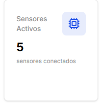
Todo a tiempo real

**Actuadores en Linea**

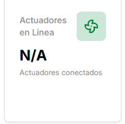
Todo, A tiempo real

**HORA LOCAL**

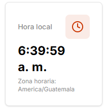

**APARTADO DE ALERTAS**

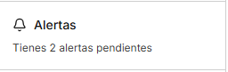

**BOTON PARA MODO OSCURO**

Siempre preocupandonos en la integridad de nuestros Colaboradores
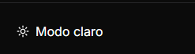

**TODOS LOS DATOS AMBIENTALES**
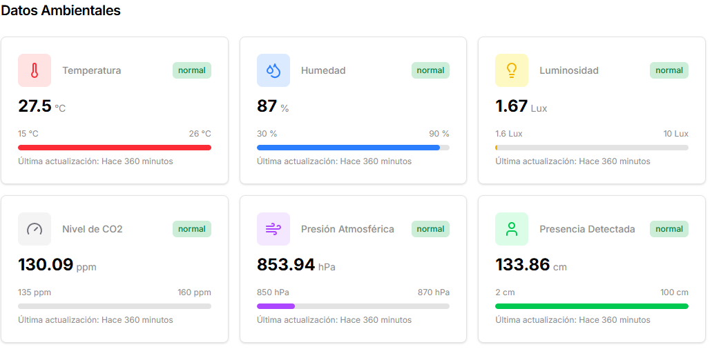
**Detalles extras**
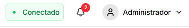
Conexion a tiempo Real, un recordatorio para las alertas Que tengamos en la Pagina y La pestaña de administrador
luego de eso nos vamos a la pestaña de:...

## PANEL HISTORICO
En este apartado Podemos controlar Datos Historicos que ha leido cada sensor, no todos pero si las ultimas 20 lecturas de cada sendor, Como por ejemplo:
**Temperatura**
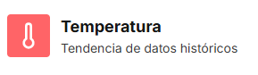
Primero Mostramos el Valor Actual, El cual, a tiempo real y la fecha actual.
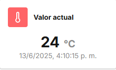

Y Ya luego tenemos nuestro apartado de las Ultimas 20 Lecturas de dicho Sensor
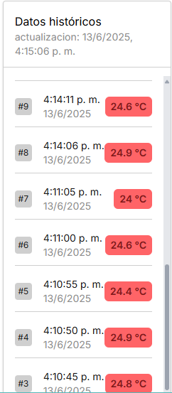

y Luego tenemos Una grafica, teniendo siempre en cuenta los ultimas 20 Lecturas.
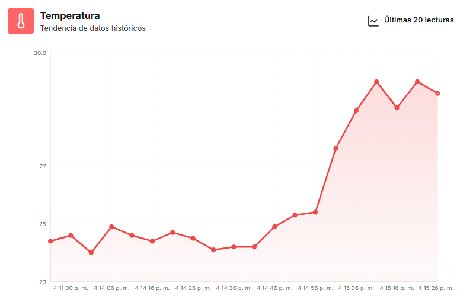
Y estas son los datos de la grafica, con la temperatura registrada y la hora en la que se tomo la lectura.
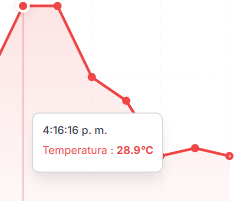

Lo mimso Con **Humedad**

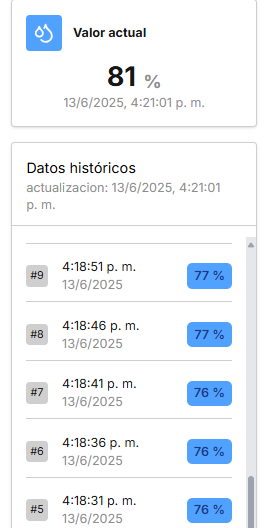
Y la Grafica con las Ultimas 20 Lecturas
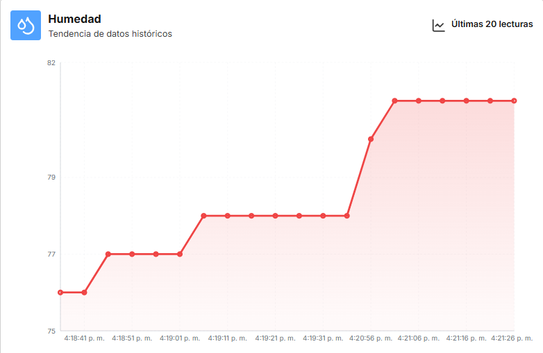

**Luminosidad**
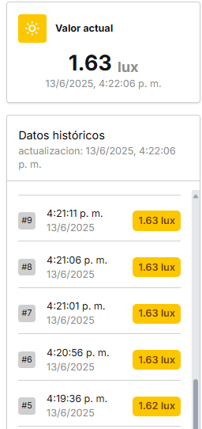

Grafica con los ultimos 20 lecturas
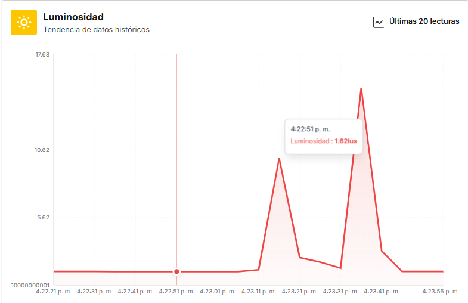

**PRESION**
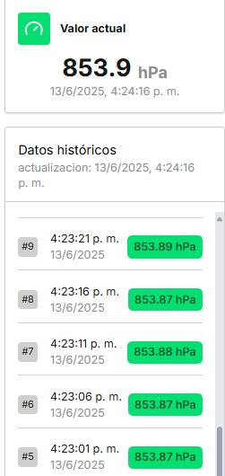

Y Luego las graficas de los ultimos 20 lecturas de los sensores

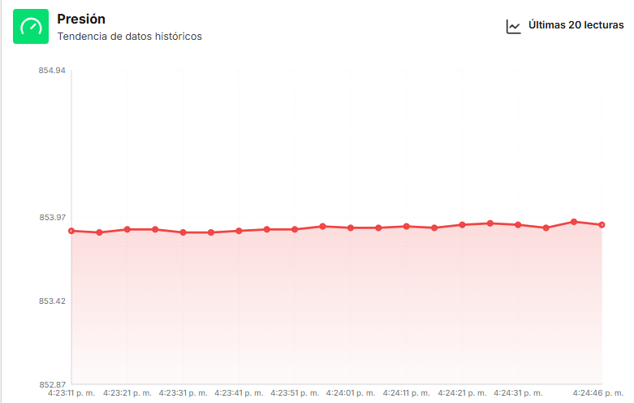

**CALIDAD DE AIRE**
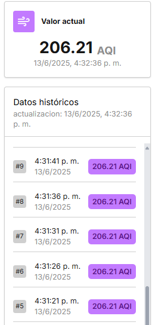
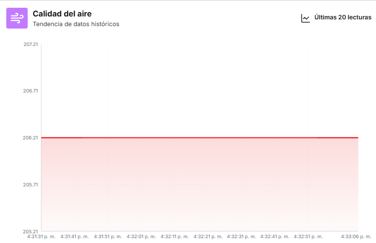

## PANEL DE CONTROL
En el panel de Control podemos controlar la manera de Utilizacion de los sensores, Ya sea de manera manual o de manera Automatica.
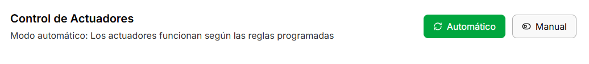

#### SENSORES EN PANEL HISTORICO
Aqui podemos ver Los Sensores en tiempo Real, cuales son activados, cuales no son activados, utilizandolos de manera sen Automatico cada uno de los sensores
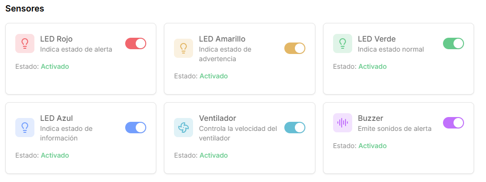
**¿COMO LAS UTILIZAMOS?**
Cuando se prende un Led Rojo es cuando se Indica Una Alerta.
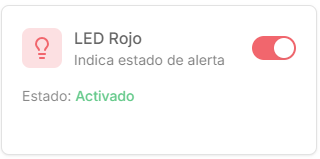
Cuando se prende una Led Amarilla es cuando se indica estado de Advertencia
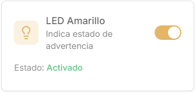
Cuando se enciende la Led Verde es por que Todos los sensores se encuentran en un estado Normal.
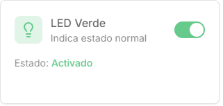
Y Cuando se enciende la Led Azul es por que todos los sensores estan en estado Informacion
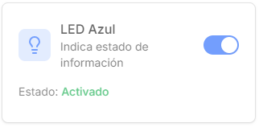

**OTRAS OPCONES**
Tambien desde este panel podemos controlar la Velocidad del control.
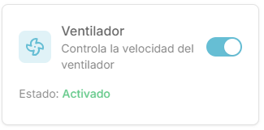
Y por ultimo este panel es el de la emision de Sonidos de Alerta para cada sensor con datos de peligro.
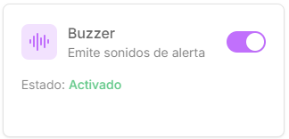

# Conclusiones
- El sistema de monitoreo y riego automatizado demuestra ser una **solución eficiente** para optimizar el uso del agua en cultivos. Al integrar sensores de humedad del suelo y un control automático, se logra **reducir el desperdicio de agua**, contribuyendo a la **sostenibilidad ambiental** y a la **preservación de recursos**.

- La implementación de una **aplicación móvil** y un **dashboard interactivo** permite a los usuarios **monitorear y gestionar** el sistema en tiempo real desde cualquier lugar. Esto no solo mejora la **accesibilidad**, sino que también **facilita la toma de decisiones informadas** sobre el riego y las condiciones ambientales del invernadero.

- El proyecto sirve como una **plataforma educativa** para estudiantes y profesionales interesados en el desarrollo de **soluciones tecnológicas sostenibles**. La combinación de **hardware** (sensores, Raspberry Pi) y **software** (aplicación móvil, visualización de datos) fomenta el **aprendizaje práctico** en áreas clave como **electrónica**, **programación** y **gestión de recursos agrícolas**.
