# Universidad de San Carlos de Guatemala

## Facultad de Ingeniería
### Escuela de Ciencias y Sistemas
#### Laboratorio de Arquitectura De Computadores Y Ensambladores 1 - Sección A
Ing. Luis Fernando Espino 
Auxiliar: Diego Jose Guevera Abaj
| No | Nombre                                        | Carné     |
|----|-----------------------------------------------|-----------|
| 1  | Bryan Josué coronado Laínez                   | 202209258 |
| 2  | Anguel Jose Miguel Davila Aspuac              | 202300360 |
| 3  | Miguel Angel Kanek Balan Velasco              | 202300765 |
| 4  | Derek Francisco Orellana Ibáñez             | 202001151 |
| 5  | Edwin Alexander Jax Lopez                     | 202200338 |

Guatemala, 13 de Junio del 2025.

<div align="center">

# MANUAL TECNICO
</div>

<div align="center">

### Proyecto Único – Fase 1
### Sistema Inteligente de Evaluación y Predicción Ambiental
</div>

<div align="center">

### INTRODUCCION
</div>

El sistema desarrollado integra múltiples funciones orientadas al monitoreo ambiental inteligente, utilizando una Raspberry Pi conectada a diversos sensores. Este módulo permite la recolección periódica de variables como temperatura, humedad, iluminación, presión barométrica, presencia o proximidad, y calidad del aire, presentando la información en tiempo real a través de una pantalla LCD y generando alertas locales según sea necesario.

A través de comunicación IoT basada en el protocolo MQTT, los datos recolectados son publicados en diferentes tópicos, permitiendo tanto el envío como la recepción de mensajes de control para la gestión remota de dispositivos. Esta arquitectura garantiza una comunicación bidireccional eficiente y desacoplada entre la Raspberry Pi y el dashboard web.

El sistema cuenta con una interfaz web que ofrece funcionalidades como autenticación de administrador, visualización en tiempo real de los datos, reportes históricos mediante gráficas, y un módulo de control remoto para los actuadores mediante MQTT.

Además, se implementa un mecanismo de gestión automática de alertas, tanto visuales en la pantalla LCD como en el dashboard web, y un control de actuadores (ventilador, iluminación, etc.) que responden automáticamente ante condiciones ambientales específicas, como temperaturas elevadas o baja iluminación.

## EL SISTEMA PERMITE
###     Funciones

#### Adquisición de Datos (Raspberry Pi + Sensores)

- Lectura periódica de:
  - Temperatura y humedad.
  - Nivel de luz.
  - Presión barométrica.
  - Detección de presencia o proximidad.
  - Calidad del Aire.
- Mostrar información en tiempo real en una pantalla LCD.
- Generación de alertas locales.

#### Comunicación IoT (MQTT)

- Publicar datos recolectados a través de tópicos MQTT:
  - Ejemplo: `GRUPO#6/sensores/rasp01/temperatura`
- Escuchar mensajes desde un tópico de control para la activación o desactivación de dispositivos de acción.
- Asegurar comunicación bidireccional desacoplada entre el dashboard y la Raspberry Pi.

#### Dashboard Web

- Login de administrador.
- Módulos principales:
  - Panel general con datos en tiempo real.
  - Reporte histórico (gráficas de los datos almacenados).
  - Apartado de control remoto de actuadores por medio de MQTT.

#### Gestión de Alertas Automáticas

- Activación de alertas visuales (LCD y dashboard web).

#### Control de Actuadores (Relay, Motor DC, Leds)

- Activación o desactivación de un ventilador en caso de que la temperatura exceda un umbral.
- Activación de luz adicional si la iluminación es baja.

### BOCETOS DEL PROTOTIPO

El diseño conceptual de nuestro sistema de riego automatizado se basa en la estructura de un invernadero, como se muestra en el boceto representado por la maqueta en la imagen. Este modelo incorpora una estructura que simula un ambiente controlado, ideal para el cultivo de plantas, y está diseñada para soportar las condiciones climáticas al aire libre.

La idea principal del sistema es replicar el funcionamiento de un sistema de lluvia, donde el agua se distribuye uniformemente sobre las plantas. Para lograr esto, se integran tuberías y boquillas que simulan la precipitación, permitiendo que el riego sea eficiente y controlado. 

El flujo de agua es gestionado de manera automática por la Raspberry Pi, que regula la cantidad y frecuencia del riego en función de los datos proporcionados por los sensores de humedad del suelo y temperatura ambiente.

La estructura está diseñada para ser completamente funcional y sostenible, utilizando materiales que permiten la instalación de los componentes electrónicos y protegen el sistema de factores externos. Este boceto sirve como base para el desarrollo del prototipo físico, integrando tanto los aspectos funcionales como estéticos del sistema.

## Imágenes de Construcción del Prototipo

- **Paso 1:** Determinar tamaños para realizar la base del invernadero y decidimos usar Madera para la base Como tal


- **Paso 2:** Construcción del invernadero con Tubos Pbc Para una mejor concentracion en cuento a Estetica y materiales reutilizables para un invernadero Ecologico.


- **Paso 3:** Cremos y le dimos forma de Invernadero, ya que necesitabamos que tuviera una forma estetica y estable para la presentacion, asi que Unimos los tubos PBC con codos PBC para la creacion de una "casa" con tubos PBC
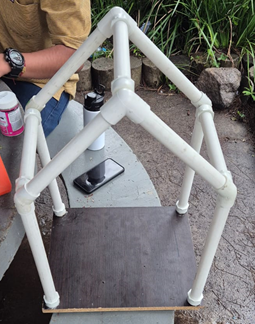

- **Paso 4:** Comenzamos a conectar cada uno de los sensores indicados Como tal, ya que necesitamos que se vea muy estetice, asi que cableamos uno por uno de una manera muy tranquila para que no sea vea aparatoso el cableado.
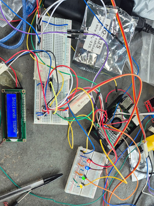 

- **Paso 5:** 
hacemos pruebas correspondientes con la pantalla Led, para ver si hay una conexcion con los sensores
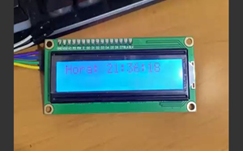

- **paso 6:**
Unir todo, Pintar y construir con cables para que todo se vea mas estetico, creacion de esteriotipos para poder Meter todo el cable dentro de un "ranchito" y no se vea mal.
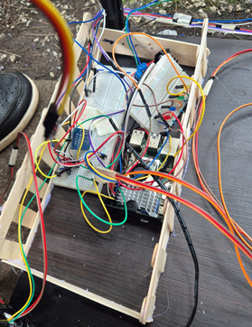

- **Paso 7:**
Arreglo de cables Junto la maqueta y Unir todo correspondiente a la Rapsberry
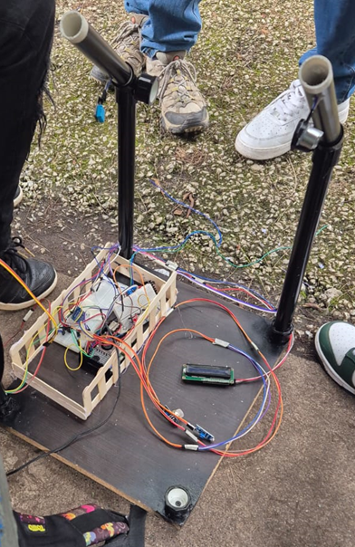

#### SESORES A UTILIZAR
# Sensores y Dispositivos de Salida

## 1. Temperatura y Humedad: DHT11 / DHT22

- **DHT11**:
  - Mide temperatura (0–50 °C) y humedad (20–80%)
  - Menor precisión, económico.
- **DHT22**:
  - Mide temperatura (-40 a 80 °C) y humedad (0–100%)
  - Mayor precisión y rango que el DHT11.

> **Usos**: Estaciones meteorológicas, climatización, agricultura.

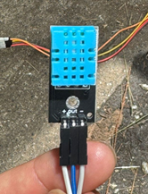
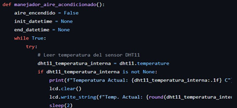

## 2. Sensor de Movimiento
- **HC-SR04 (Ultrasónico)**:
  - Mide distancia usando ondas ultrasónicas.
  - No detecta movimiento directamente, sino la presencia de objetos.

- **PIR (Infrarrojo Pasivo)**:
  - Detecta movimiento por cambios de calor (como el de una persona).
  - No mide distancia, solo presencia de movimiento.

> **Usos**: Alarmas, iluminación automática, detección de presencia.

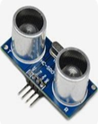
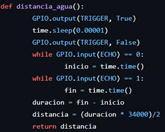
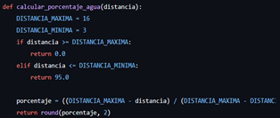

## 3. Sensor de Iluminación: Fotoresistencia (LDR)

- Cambia su resistencia según la cantidad de luz.
  - Más luz → menor resistencia.
  - Menos luz → mayor resistencia.

> **Usos**: Control de luces automáticas, sistemas de ahorro de energía.

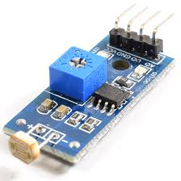

## 4. Sensor de Presión: BMP280

- Mide:
  - Presión atmosférica
  - Temperatura
  - Altitud (calculada)
- Alta precisión, bajo consumo.

> **Usos**: Meteorología, drones, altímetros, monitoreo ambiental.

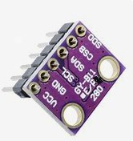
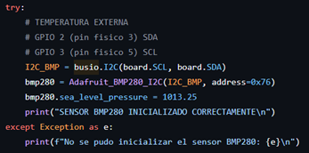

## 5. Sensor de CO₂: MQ135

- Detecta varios gases contaminantes:
  - Dióxido de carbono (CO₂)
  - Amoníaco, alcohol, benceno, humo, etc.
- Necesita un tiempo de calentamiento para lecturas estables.

> **Usos**: Control de calidad del aire, purificadores, sistemas de ventilación.

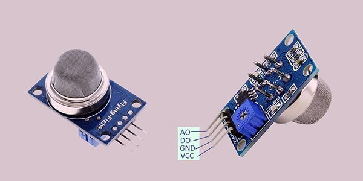
## 6. Dispositivos de Salida

### Pantalla LCD (con o sin módulo I2C)
- Muestra datos como temperatura, humedad, mensajes, etc.
- **Con I2C**: Usa solo 4 pines (más simple).

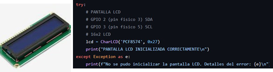
### LEDs
- Señales visuales simples (estado, advertencias).

### Motor DC
- Movimiento rotativo.
- Usado para ventilación, ruedas, mecanismos de apertura.

### Buzzer
- Emite sonidos o alarmas.
- Ideal para advertencias o confirmaciones auditivas.

> **Usos**: Interacción con el usuario, alertas, automatización.


## MATERIALES UTILIZADOS
### Componentes del Sistema

##### Jumper 20 cm MxM, MxH
- Cables de conexión utilizados para establecer enlaces entre diferentes componentes del circuito, como sensores, Raspberry Pi, y la protoboard.

##### Pantalla LCD 1602 Azul con I2C
- Pantalla que permite visualizar información como los valores de temperatura, humedad, nivel de agua y estado del sistema de riego en tiempo real. El módulo I2C simplifica su conexión a la Raspberry Pi.

##### Sensor ultrasónico HC-SR04
- Sensor utilizado para medir la distancia o nivel del agua en el tanque, enviando alertas cuando el nivel desciende por debajo de un umbral crítico.

##### Kit de riego automático (IT21032)
- Incluye los elementos necesarios para implementar el sistema de riego, como tuberías, boquillas y una bomba de agua, diseñados para automatizar la irrigación de cultivos.

##### Módulo BMP280/BME280
- Sensor de presión barométrica y temperatura que permite medir variables climáticas, útil para monitorear las condiciones ambientales del invernadero.

##### Sensor DHT11
- Sensor que mide la temperatura y la humedad relativa del entorno. Ideal para ajustar el sistema de riego y ventilación según las condiciones climáticas.

##### Raspberry Pi
- Microcontrolador que actúa como el cerebro del sistema. Procesa los datos de los sensores y controla las funciones de riego y ventilación, además de permitir la conectividad con la aplicación móvil.

##### Pelador de cables
- Herramienta para preparar los cables, permitiendo una conexión más segura y eficiente en el ensamblaje del sistema eléctrico.

##### Fuente de alimentación
- Proporciona la energía necesaria para los diferentes componentes del sistema, garantizando su funcionamiento continuo.

##### Protoboard
- Base para realizar conexiones eléctricas temporales entre los sensores, actuadores y la Raspberry Pi durante la fase de pruebas.

##### Ventilador
- Componente encargado de controlar la temperatura interna del invernadero. Se activa automáticamente cuando la temperatura excede un umbral definido.

## ¿QUE ES UNA RAPSBERRY PI?
## Raspberry Pi

La **Raspberry Pi** es una serie de microcomputadoras de bajo costo, tamaño reducido y alto rendimiento, desarrolladas por la Raspberry Pi Foundation. Está diseñada para ser accesible, flexible y apta para diversos proyectos de computación, electrónica y aprendizaje de programación.

### Características Generales

- **Procesador:** CPU ARM de varios núcleos (dependiendo del modelo).
- **Memoria RAM:** Varía según el modelo (desde 512MB hasta 8GB en modelos recientes).
- **Almacenamiento:** Utiliza tarjetas microSD para el sistema operativo y el almacenamiento de datos.
- **Puertos de conexión:**
  - USB (2.0, 3.0 en modelos nuevos)
  - HDMI (micro o estándar)
  - Jack de audio y video
  - Puerto Ethernet (en algunos modelos)
  - GPIO (General Purpose Input Output): pines para conectar sensores, actuadores y otros dispositivos electrónicos.
- **Conectividad:** Wi-Fi, Bluetooth (en modelos modernos).
- **Sistema Operativo:** Principalmente Raspberry Pi OS (basado en Debian), aunque es compatible con otros sistemas como Ubuntu, Windows IoT, entre otros.
- **Consumo energético:** Bajo consumo, ideal para proyectos de larga duración o portátiles.

### Aplicaciones Comunes

- Automatización del hogar.
- Robótica y sistemas embebidos.
- Estaciones meteorológicas.
- Control de sistemas de riego o invernaderos.
- Servidores personales (web, NAS, VPN).
- Aprendizaje de programación y desarrollo de software.
- Proyectos de IoT (Internet of Things).

### Ventajas

- Bajo costo.
- Gran comunidad de soporte.
- Amplia documentación y proyectos disponibles.
- Compatible con múltiples lenguajes de programación (Python, C/C++, Java, etc.).
- Permite el aprendizaje práctico de hardware y software.

### Ejemplo de Modelos Populares

| Modelo          | Procesador      | RAM         | Notas Adicionales |
|------------------|------------------|-------------|--------------------|
| Raspberry Pi 4B  | Quad-core 1.5GHz | 2GB-8GB     | Soporta doble monitor 4K |
| Raspberry Pi 3B+ | Quad-core 1.4GHz | 1GB         | Wi-Fi y Bluetooth integrados |
| Raspberry Pi Zero W | Single-core 1GHz | 512MB   | Muy compacto, bajo consumo |


### PRESUPUESTO UTILIZADO
# Presupuesto de Componentes para Sistema de Invernadero Automatizado

| Componente | Descripción | Precio Unitario (Q) | Cantidad | Total (Q) |
|------------|-------------|----------------------|----------|------------|
| Jumper wires 20 cm MxM/MxH | Cables de conexión | Q 25 | 1 paquete | Q 25 |
| Pantalla LCD 1602 Azul con I2C | Módulo LCD con adaptador I2C | Q 90 | 1 | Q 90 |
| Sensor ultrasónico HC‑SR04 | Medición de nivel de agua | Q 45 | 1 | Q 45 |
| Kit de riego automático IT21032 | Incluye bomba, tubería, boquillas | Q 450 | 1 | Q 450 |
| Módulo BMP280 | Sensor de presión y temperatura | Q 75 | 1 | Q 75 |
| Sensor DHT11 | Medición de temperatura y humedad | Q 40 | 1 | Q 40 |
| Raspberry Pi 4 Model 4GB | Microcontrolador | Q 600 | 1 | Q 600 |
| Pelador de cables | Herramienta para desforrar | Q 35 | 1 | Q 35 |
| Fuente de alimentación | 5V/3A para Raspberry | Q 80 | 1 | Q 80 |
| Protoboard | Base de conexiones temporales | Q 50 | 1 | Q 50 |
| Ventilador 12V | Control de temperatura | Q 90 | 1 | Q 90 |
| **Subtotal** | | | | **Q 1580** |
| IVA (12%) | Impuesto al consumo | | | **Q 189.60** |
| **Total con IVA** | | | | **Q 1769.60** |

## FRONTED
#### ¿Como esta Conformado el Frontend?

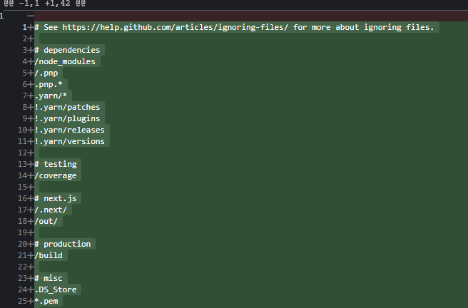
#### Resumen del código
Perfecto, ahora te explico este código línea por línea.
Este es un archivo de configuración de ESLint usando el nuevo formato "Flat Config" que ESLint ha introducido recientemente.


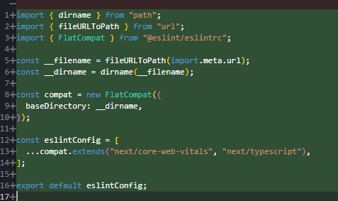
#### Resumen del código
Este archivo: Usa el nuevo sistema Flat Config de ESLint.
Permite seguir usando presets antiguos de Next.js + TypeScript sin tener que reescribirlos manualmente.
Utiliza FlatCompat para la compatibilidad.
Funciona con ES Modules (import / export default).


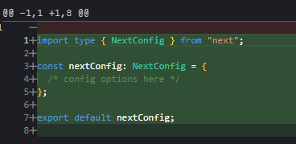
#### Resumen del código
Este código define la configuración para una app de Next.js.
Importa el tipo NextConfig (para tener autocompletado y validación).
Crea un objeto nextConfig donde irían las opciones de configuración.
Exporta nextConfig para que Next.js lo use.


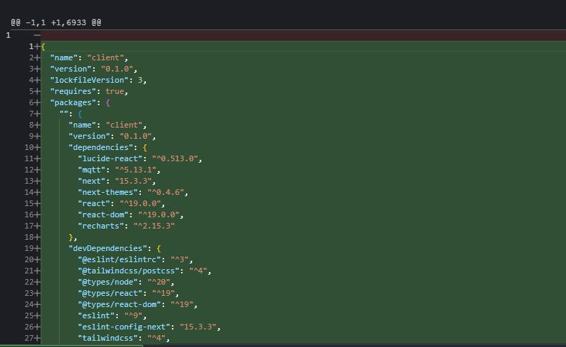
#### Resumen del código
Esto es un fragmento del package-lock.json de un proyecto Node.js / Next.js.
Declara el proyecto (client), su versión y dependencias (como next, react, mqtt, tailwindcss, etc.).
Las secciones node_modules/... indican los paquetes instalados, sus versiones exactas y metadatos (licencia, integridad, engines, etc.).
Sirve para que NPM instale siempre las mismas versiones.


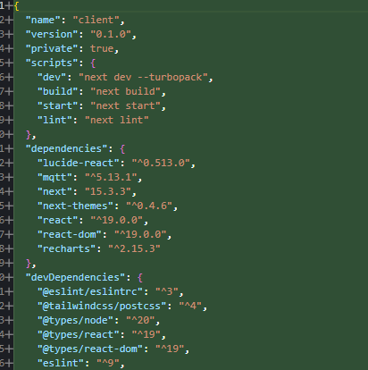
#### Resumen del código
Es el package.json de un proyecto Next.js.
Nombre: client, versión: 0.1.0.
Scripts: comandos para desarrollo, build, start y lint.
Dependencias: librerías que usa el proyecto (Next.js, React, MQTT, gráficos, temas, íconos).
DevDependencies: herramientas de desarrollo (TypeScript, ESLint, TailwindCSS, tipos, etc.).
Sirve para definir y gestionar el entorno del proyecto.


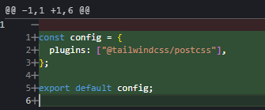
#### Resumen del código
Archivo de configuración (probablemente PostCSS).
- Usa el plugin `@tailwindcss/postcss` para integrar TailwindCSS.
- Exporta la configuración para que el sistema lo utilice.


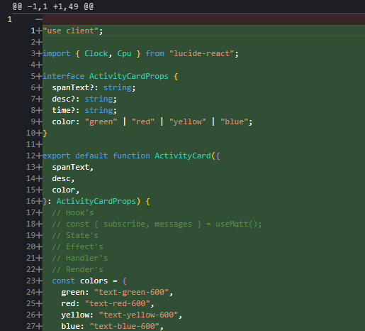
#### Resumen del código
Componente `ActivityCard` en React (Next.js - cliente).

- Importa íconos `Clock` y `Cpu` desde `lucide-react`.
- Recibe props: `spanText`, `desc`, `time` (no usado), y `color` (con valores limitados).
- Define clases CSS según el color recibido.
- Renderiza una tarjeta con:
  - Ícono `Cpu` coloreado.
  - Texto principal (`spanText` y `desc`).
  - Texto de tiempo fijo ("hace 5 minutos") con ícono `Clock`.
- Tiene animación al hacer hover (`hover:translate-x-2`).
Es una tarjeta de actividad simple con diseño responsive y colores variables.


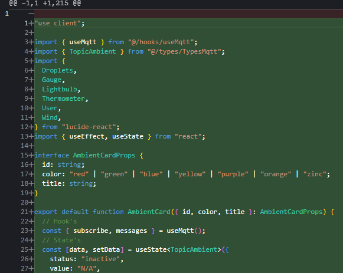
#### Resumen del código

Componente `AmbientCard` en React (Next.js - cliente).

- **Props:** `id`, `color`, `title`.
- **Hook personalizado:** `useMqtt()` para suscribirse a un topic MQTT dinámico según `id`.
- **Estados:**
  - `data`: guarda los datos del sensor (`status`, `value`, `min`, `max`, `timestamp`, `unit`).
  - `timestamp`: calcula tiempo transcurrido desde la última actualización.
- **Efectos (`useEffect`):**
  - Suscribe al topic MQTT correspondiente.
  - Actualiza `data` al recibir nuevos mensajes MQTT.
  - Calcula y actualiza el tiempo transcurrido periódicamente.
- **Colores e íconos:** mapeados según `color` y `id` recibido.
- **Render:**
  - Muestra ícono, título, estado (`normal`, `warning`, `critical`).
  - Muestra valor actual, unidades, rangos `min` y `max`.
  - Barra de progreso proporcional al valor.
  - Última actualización de tiempo.

👉 Es una tarjeta de monitoreo de sensores MQTT con diseño dinámico, colores temáticos, estados de alerta y tiempo en vivo.


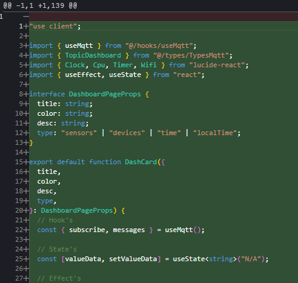
#### Resumen del código

Componente `DashCard` en React (Next.js - cliente).

- **Props:** `title`, `color`, `desc`, `type` (`sensors`, `devices`, `time`, `localTime`).
- **Hook personalizado:** `useMqtt()` para suscribirse a topics MQTT según el tipo.
- **Estado:** `valueData` guarda el dato a mostrar.
- **Efectos (`useEffect`):**
  - Suscribe al topic MQTT dependiendo del `type`.
  - Actualiza `valueData` al recibir nuevos mensajes MQTT.
  - Si `type` es `time`, convierte segundos a formato `h m s`.
  - Si `type` es `localTime`, actualiza cada segundo con la hora actual.
- **Colores e íconos:** seleccionados según `color` y `type`.
- **Render:**
  - Título, ícono temático.
  - Valor actualizado (`valueData`).
  - Descripción o la hora actual según `type`.

Es una tarjeta de resumen de estado para el dashboard, usando datos en tiempo real de MQTT o del sistema.


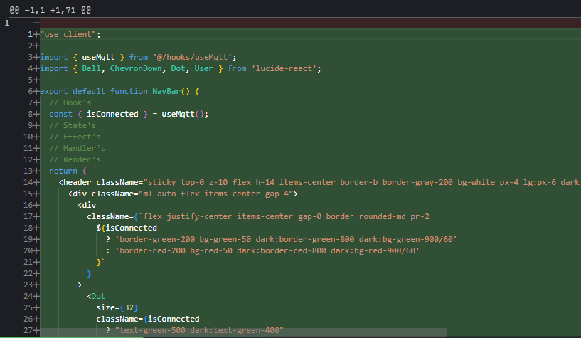
#### Resumen del código

Componente `NavBar` en React (Next.js - cliente).

- **Hook personalizado:** `useMqtt()` para obtener el estado de conexión (`isConnected`).
- **Renderiza:** 
  - Un header fijo en la parte superior (`sticky top-0`).
  - Indicador de conexión:
    - Si está conectado: fondo y texto en verde.
    - Si está desconectado: fondo y texto en rojo.
  - Botón de notificaciones (`Bell`), con un badge de notificaciones simuladas (fijo en `2`).
  - Botón de perfil de usuario:
    - Muestra el ícono de usuario (`User`), el texto `Administrador` (oculto en pantallas pequeñas) y un ícono de flecha (`ChevronDown`).

Es una barra de navegación superior con estado de conexión, notificaciones y menú de usuario, usando diseño responsivo y temas claro/oscuro.


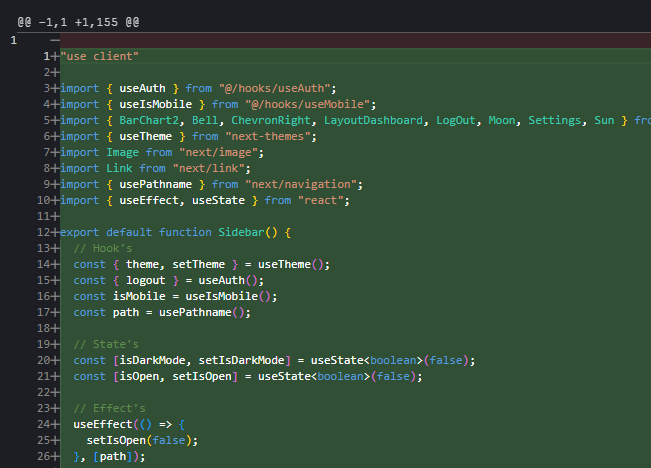
#### Resumen Del Codigo
**Sidebar**

- **Función:** Barra lateral de navegación.
- **Rutas:** Dashboard, Histórico, Control.
- **Hooks:** `useTheme`, `useAuth`, `useIsMobile`, `usePathname`.
- **Estados:** `isDarkMode`, `isOpen`.
- **Móvil:** Soporte con pestaña lateral y overlay.
- **Acciones:** Cambiar tema, cerrar sesión.
- **Extras:** Muestra alertas pendientes.
- **Estilo:** Soporte para dark mode, transiciones suaves.


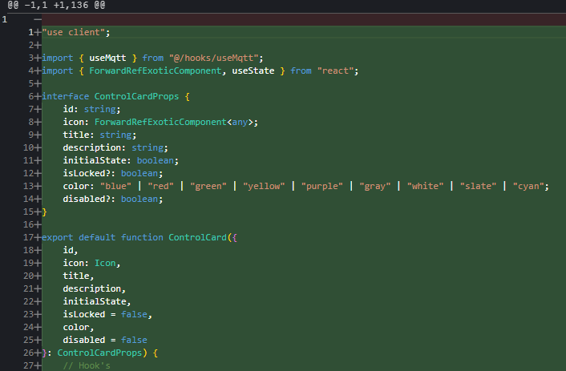
#### Resumen del Codigo
**ControlCard** 

Componente React que muestra una tarjeta con un switch para activar/desactivar un control.

- **Props**: `id`, `icon`, `title`, `description`, `initialState`, `color`, opcionales `isLocked` y `disabled`.
- **Estado**: `isOn` controla si está activado.
- **Función**: Al togglear, cambia estado y publica mensaje MQTT con `id` y nuevo estado.
- **Estilos**: Dinámicos según color y estado, incluye indicador de bloqueo y deshabilitado.


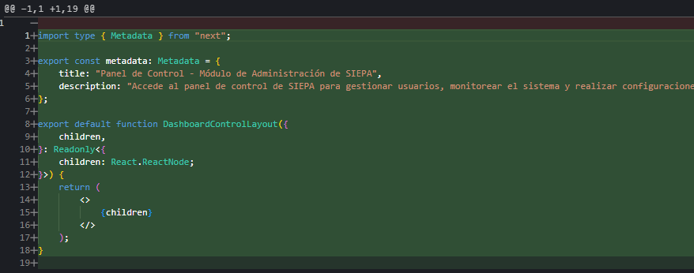
#### Resumen de Codigo
Componente layout simple que envuelve contenido y define metadata con título y descripción para el Panel de Control de SIEPA.


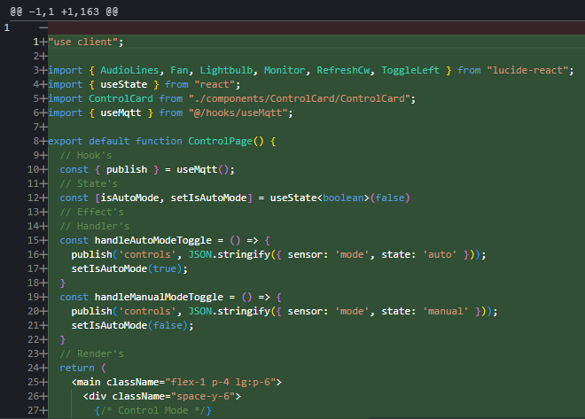
#### Resumen de Codigo
Componente que controla el modo automático/manual de actuadores y muestra tarjetas para manejar dispositivos como ventiladores, luces y buzzer.  
- Cambia modo con botones que publican estado vía MQTT.  
- En modo automático, los controles individuales se desactivan.  
- Usa componentes `ControlCard` para cada actuador con iconos, estado inicial y color.  


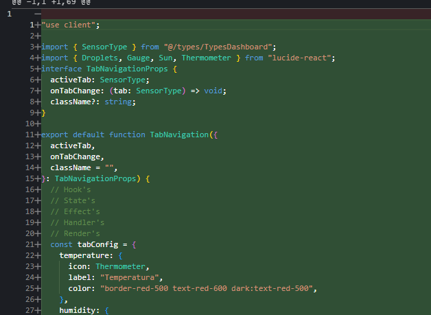
#### Resumen de Codigo
Componente de navegación por pestañas para sensores (temperatura, humedad, luminosidad, presión).  
- Muestra botones con íconos y colores específicos según el tipo de sensor.  
- Destaca la pestaña activa y permite cambiarla mediante `onTabChange`.  
- Estilizado para modo claro y oscuro con animaciones suaves.  


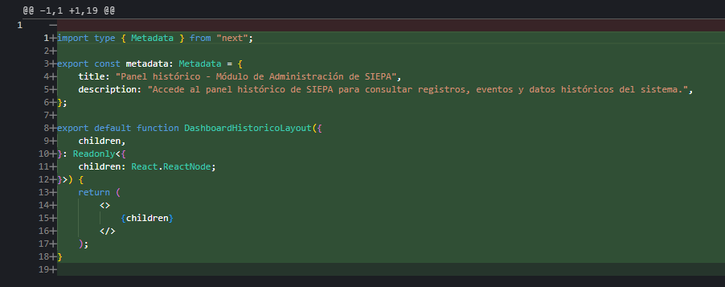
#### Resumen de Codigo
Define metadata para el panel histórico de SIEPA con título y descripción.  
Componente layout que solo renderiza sus hijos sin lógica adicional.  


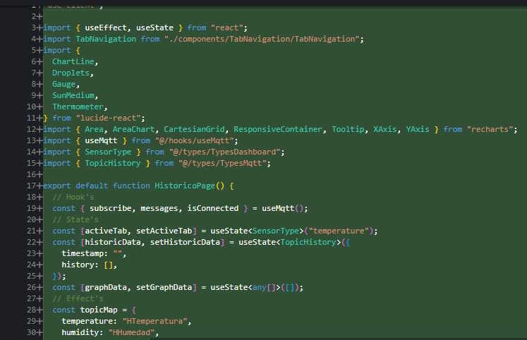

##### Resumen del componente `HistoricoPage`

##### Estructura general
Este componente de React muestra **gráficas históricas** de sensores (temperatura, humedad, luminosidad y presión) usando **Recharts** y datos recibidos por MQTT.

##### MQTT
- Utiliza el hook `useMqtt` para suscribirse a los tópicos de sensores.
- Obtiene mensajes en tiempo real y actualiza el estado con los datos históricos.

##### Estado (`useState`)
- `activeTab`: sensor activo (tipo de dato que se muestra).
- `historicData`: datos históricos del sensor.
- `graphData`: datos transformados para la gráfica.
##### Efectos (`useEffect`)
1. Se suscribe a los tópicos de sensores al establecer conexión MQTT.
2. Cada vez que llegan mensajes, transforma y actualiza los datos para la gráfica y visualización.
##### Interfaz de usuario
- **`TabNavigation`** permite cambiar entre sensores.
- Se muestra un resumen con:
  - Icono, nombre y unidad del sensor.
  - Gráfica de datos históricos.
  - Último valor recibido y su fecha/hora.
  - Lista de todas las lecturas con sus valores.

##### Librerías usadas
- `lucide-react`: iconos.
- `recharts`: para generar gráficas.
- `TailwindCSS`: estilos.
- `useMqtt`: hook personalizado para conexión MQTT.

##### Sensor soportados
- Temperatura (`temperature`)
- Humedad (`humidity`)
- Luminosidad (`luminosity`)
- Presión (`pressure`)

##### Funcionalidades destacadas
- Adaptabilidad con `ResponsiveContainer`.
- Tooltips personalizadas.
- Estilos dinámicos por tipo de sensor.
- Histórico desplazable y organizado por fecha.


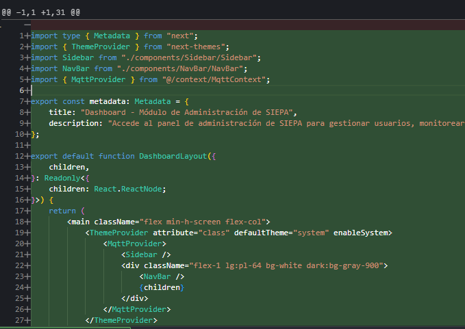
##### Resumen del Codigo
##### DashboardLayout

Layout principal del panel de administración.  
Incluye:

- `ThemeProvider`: modo claro/oscuro  
- `MqttProvider`: contexto MQTT  
- `Sidebar` y 🔝 `NavBar`  
- `children`: contenido dinámico  

Define `metadata` para SEO.


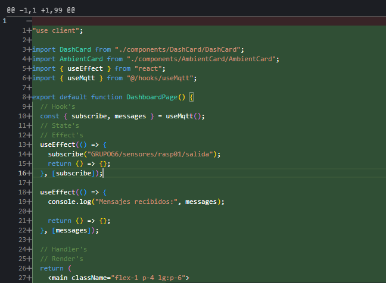
##### Resumen del Codigo
##### DashboardPage

Página principal del dashboard.

- Se suscribe al topic MQTT de sensores
- Muestra tarjetas de:
  - Sensores activos
  - Dispositivos conectados
  - Tiempo de ejecución
  - Hora local
- Visualiza datos ambientales con `AmbientCard`


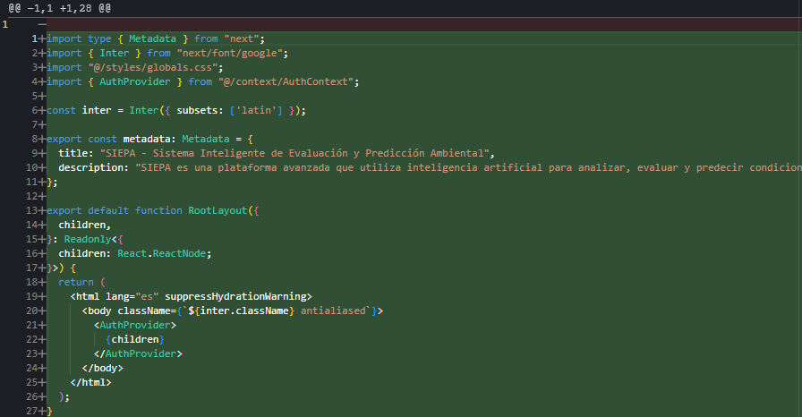
##### Resumen de Codigo
##### RootLayout

Layout raíz de la app.

- Define metadatos (título y descripción de SIEPA)
- Usa fuente **Inter**
- Envuelve la app en `AuthProvider` (contexto de autenticación)
- Carga estilos globales


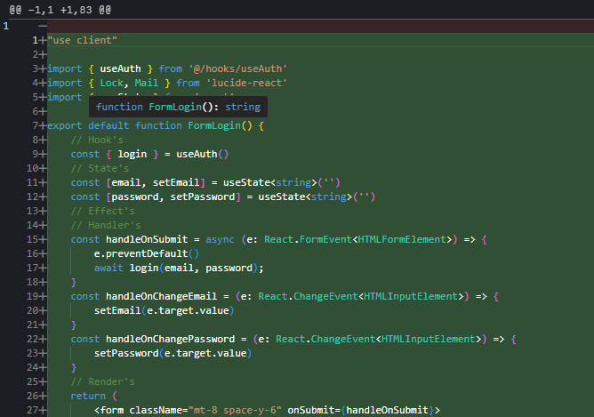
##### Resumen del Codigo
##### FormLogin

Formulario de inicio de sesión con autenticación.

- Campos: email y contraseña
- Usa `useAuth()` para llamar a `login()`
- Estilos con íconos (`Mail`, `Lock`) y diseño responsive
- Maneja estados y cambios con `useState`


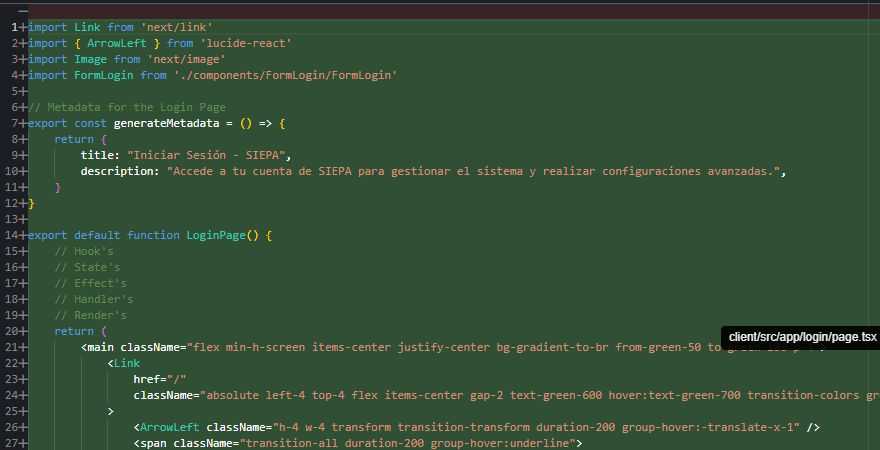
##### Resumen del Codigo
##### LoginPage

Página de inicio de sesión de SIEPA.

- Botón para volver al inicio
- Logo de SIEPA y diseño con fondo degradado
- Incluye `FormLogin`
- Enlace para registrarse si no tienes cuenta


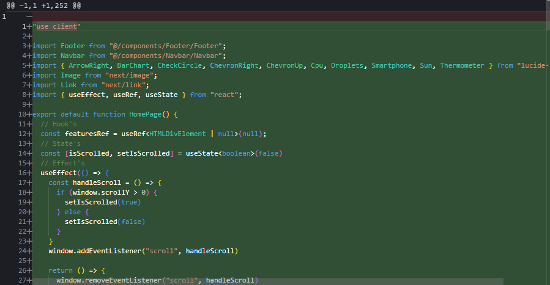
##### Resumen Codigo
##### HomePage – Página Principal de SIEPA

Este componente representa la **página principal** de la plataforma **SIEPA (Sistema Inteligente de Evaluación y Predicción Ambiental)**. Está diseñado para informar, atraer e invitar a los usuarios a interactuar con la plataforma mediante un diseño moderno, animaciones suaves y contenido relevante.

##### Estructura General

- El componente se organiza como una estructura de página completa (`<main>`), con distintas secciones:
  - **Navbar** (barra de navegación)
  - **Hero** (sección introductoria)
  - **Features** (funciones del sistema)
  - **Benefits** (beneficios del sistema)
  - **CTA** (llamada a la acción)
  - **Botón flotante** (ir arriba)
  - **Footer** (pie de página)

---

##### Hooks Utilizados

- `useRef`:
  - Se usa para hacer scroll suave a la sección de características.
- `useState` y `useEffect`:
  - Se utilizan para detectar el desplazamiento de la página y mostrar/ocultar el botón flotante de "ir arriba".

##### Secciones Destacadas

##### Hero Section
- Presenta el nombre del sistema y una descripción destacada.
- Usa un botón "Saber más" para hacer scroll a la sección de características.
- Imagen decorativa de un invernadero inteligente.

##### Features Section
- Presenta una **rejilla de funciones clave** como:
  - Temperatura
  - Humedad
  - Movimiento
  - Iluminación
  - Presión
  - CO₂
  - Acceso móvil
- Cada función tiene un ícono representativo y una breve descripción.

##### Benefits Section
- Describe los beneficios de usar SIEPA, incluyendo:
  - Aumento de productividad
  - Eficiencia energética
  - Monitoreo en tiempo real
  - Toma de decisiones informadas
- Acompañado por una imagen de una maqueta del sistema.

##### CTA Section
- Llamado a la acción para iniciar sesión.
- Diseño destacado con fondo verde y logo invertido para contraste.
- Botón prominente: **"Comienza ahora"**.

##### Botón de Volver Arriba
- Botón flot


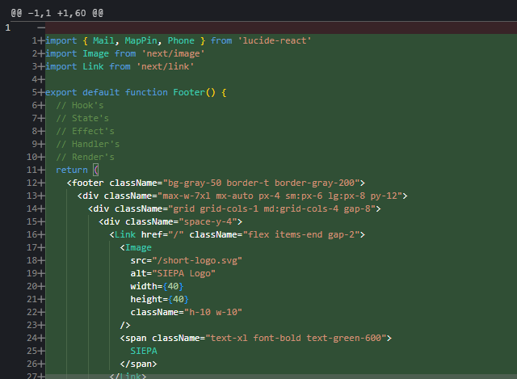
##### Resumen muy breve del Footer

- Componente footer con fondo gris claro y borde superior.  
- Logo + nombre "SIEPA" que linkea a inicio.  
- Descripción corta del sistema.  
- Contacto: dirección, teléfono y correo con iconos verdes.  
- Texto centrado con copyright y año actual.  
- Diseño responsive usando grid y estilos simples.


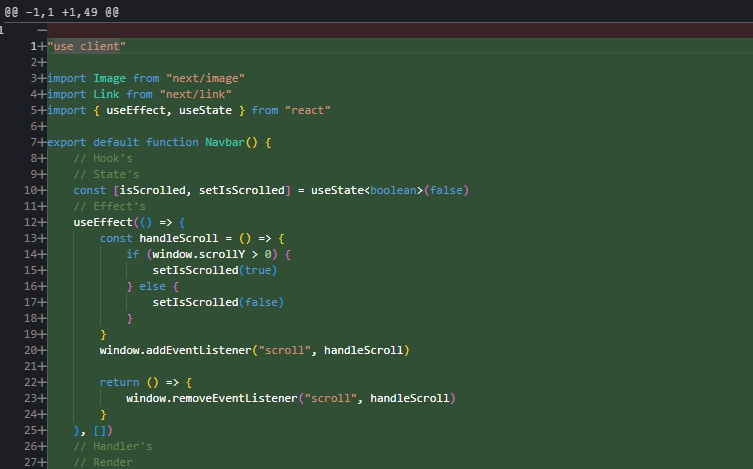
##### Resumen de Codigo
##### Resumen Navbar

- Barra fija en top con fondo transparente o blanco al hacer scroll.  
- Logo + texto "SIEPA" que linkea a inicio.  
- Botón "Iniciar Sesión" a la derecha.  
- Usa `useState` y `useEffect` para detectar scroll y cambiar estilos.  
- Transiciones suaves para cambio de fondo y sombra.


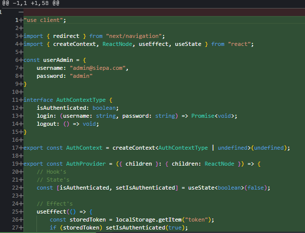
##### Resuen de Codigo 
##### Resumen AuthProvider

- Provee contexto de autenticación (`isAuthenticated`, `login`, `logout`).  
- Usa `useState` para estado de autenticación.  
- En `useEffect` verifica token en `localStorage` para mantener sesión.  
- `login` valida credenciales estáticas, guarda sesión en `localStorage` y cookie, y redirige a dashboard.  
- `logout` limpia sesión y cookie, redirige a home.  
- Exporta `AuthContext` para consumir estado y métodos en la app.


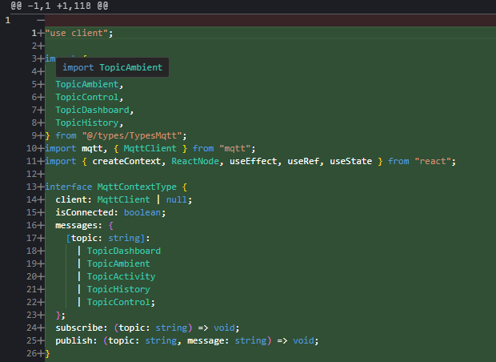
##### Resumen de Codigo 
##### Resumen MqttProvider

- Crea contexto MQTT con estado de conexión y mensajes por tópico.  
- Se conecta al broker MQTT al montar el componente.  
- Guarda/recupera mensajes en `localStorage`.  
- Escucha mensajes y actualiza estado y almacenamiento local.  
- Provee funciones para suscribirse y publicar en tópicos.  
- Limpia conexión al desmontar.  


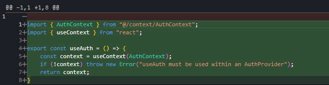
##### Resumen de Codigo
##### Resumen useAuth

- Consume el contexto `AuthContext`.  
- Lanza error si se usa fuera de `AuthProvider`.  
- Devuelve el contexto para usar autenticación fácilmente.  


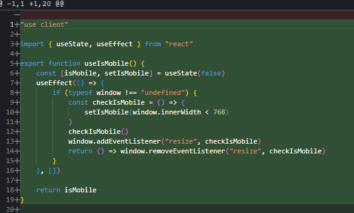
##### Resumen del Codigo
##### Resumen useIsMobile

- Detecta si la pantalla es móvil (<768px de ancho).  
- Usa `useState` para almacenar el estado.  
- Usa `useEffect` para actualizar estado al cargar y al cambiar tamaño.  
- Devuelve `true` si es móvil, `false` si no.  


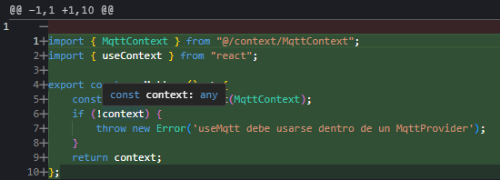
##### Resumen del Codigo
##### Resumen useMqtt

- Consume el contexto `MqttContext`.  
- Verifica que el contexto exista, sino lanza error.  
- Devuelve el contexto con cliente MQTT, estado de conexión, mensajes y funciones para suscribir/publicar.  


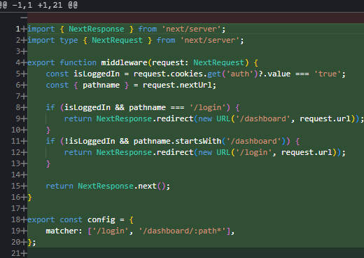
##### Resumen de Codigo
##### Resumen Middleware de Autenticación

- Verifica si el usuario está autenticado mediante la cookie `auth`.
- Si está autenticado y visita `/login`, redirige a `/dashboard`.
- Si no está autenticado y trata de acceder a rutas que empiezan con `/dashboard`, redirige a `/login`.
- Permite pasar a otras rutas sin cambios.
- Configura el middleware para que afecte a `/login` y todas las rutas bajo `/dashboard`.


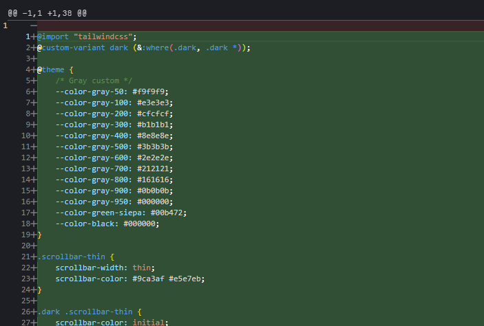
##### Resumen del Código CSS/SCSS

- Importa Tailwind CSS.
- Define un custom variant `dark` que aplica estilos en modo oscuro (clase `.dark`).
- Declara variables CSS personalizadas para tonos de gris (`--color-gray-50` a `--color-gray-950`), un verde personalizado (`--color-green-siepa`) y negro.
- Estiliza scrollbars con clase `.scrollbar-thin` para que sean delgados y con colores específicos, que cambian en modo oscuro.
- Corrige el estilo de autofill de inputs en navegadores WebKit para evitar fondo amarillo y usar fondo blanco con texto negro.


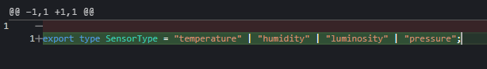

##### Resumen del Codigo
##### Resumen del tipo TypeScript

- Define un tipo llamado `SensorType`.
- `SensorType` es una unión literal de strings.
- Los posibles valores son: `"temperature"`, `"humidity"`, `"luminosity"`, `"pressure"`.


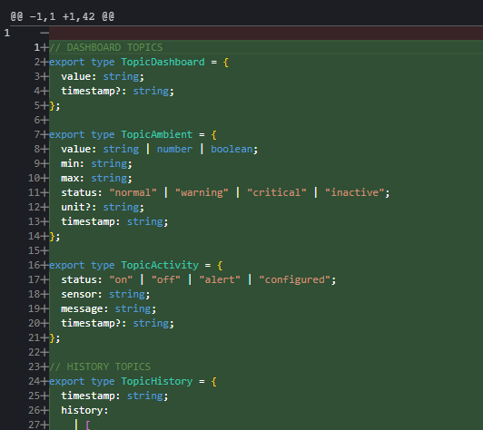
##### Resumen del Codigo
##### Resumen de tipos para tópicos MQTT

- **TopicDashboard**  
  Representa un dato simple con:  
  - `value`: string  
  - `timestamp?`: string opcional

- **TopicAmbient**  
  Datos ambientales con:  
  - `value`: string | number | boolean  
  - `min`: string  
  - `max`: string  
  - `status`: "normal" | "warning" | "critical" | "inactive"  
  - `unit?`: string opcional  
  - `timestamp`: string

- **TopicActivity**  
  Estado de actividad con:  
  - `status`: "on" | "off" | "alert" | "configured"  
  - `sensor`: string  
  - `message`: string  
  - `timestamp?`: string opcional

- **TopicHistory**  
  Historial con:  
  - `timestamp`: string  
  - `history`: array con objetos `{ date: string; hora: string; valor: string }` o vacío

- **TopicControl**  
  Control de sensor con:  
  - `sensor`: string  
  - `status`: boolean


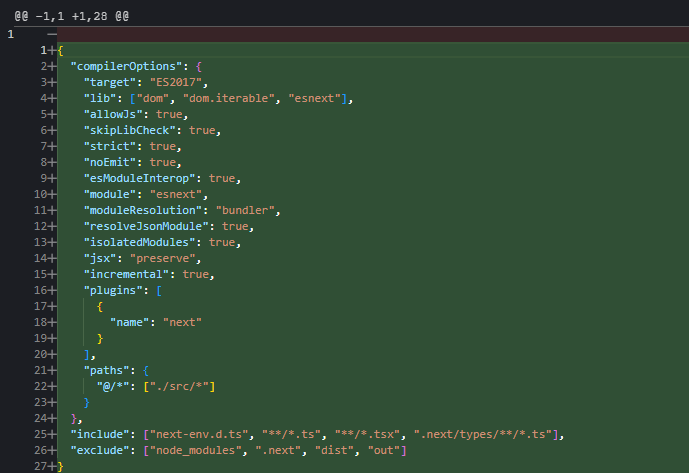
##### Resumen del Codigo
##### Resumen del archivo tsconfig.json

- **compilerOptions**:
  - `"target": "ES2017"`: Código compilado a ES2017.
  - `"lib": ["dom", "dom.iterable", "esnext"]`: Incluye librerías DOM y ESNext.
  - `"allowJs": true`: Permite incluir archivos JavaScript.
  - `"skipLibCheck": true`: Omite chequeo de tipos en archivos de librerías.
  - `"strict": true`: Habilita el modo estricto de TypeScript.
  - `"noEmit": true`: No genera archivos de salida (solo chequeo).
  - `"esModuleInterop": true`: Facilita interoperabilidad con módulos CommonJS.
  - `"module": "esnext"`: Usa módulo ESNext.
  - `"moduleResolution": "bundler"`: Resolución de módulos para bundlers modernos.
  - `"resolveJsonModule": true`: Permite importar archivos JSON.
  - `"isolatedModules": true`: Requiere que cada archivo pueda ser compilado de forma aislada.
  - `"jsx": "preserve"`: Preserva JSX para que Next.js lo procese.
  - `"incremental": true`: Habilita compilación incremental.
  - `"plugins"`: Usa plugin específico para Next.js.
  - `"paths"`: Alias para importar desde `@/` apuntando a `./src/`.

- **include**: Archivos incluidos para compilación (`*.ts`, `*.tsx`, archivos de tipos Next.js).

- **exclude**: Carpetas excluidas (`node_modules`, `.next`, `dist`, `out`).


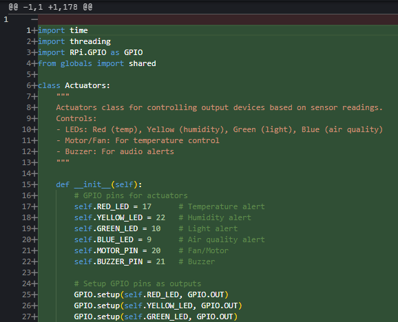

##### Resumen Del Codigo
##### Resumen de la clase `Actuators`

- **Propósito:** Controlar actuadores físicos (LEDs, motor, buzzer) según sensores.

- **Actuadores:**
  - LEDs: rojo (temperatura), amarillo (humedad), verde (luz), azul (calidad de aire).
  - Motor/fan: control de temperatura.
  - Buzzer: alertas sonoras.

- **Funciones clave:**
  - `__init__`: configura pines GPIO y apaga todos los actuadores.
  - `turn_off_all()`: apaga todos los actuadores y actualiza estado compartido.
  - `control_led(led_pin, led_name, state)`: enciende/apaga LED con temporizador auto-off 5s.
  - `_auto_off_led()`: apaga LED automáticamente tras temporizador.
  - `control_motor(state)`: controla motor con temporizador auto-off 5s.
  - `_auto_off_motor()`: apaga motor automáticamente.
  - `control_buzzer(state, duration)`: controla buzzer con duración configurable.
  - `_auto_off_buzzer()`: apaga buzzer automáticamente.
  - `check_alerts_and_control()`: verifica sensores y activa actuadores según umbrales:
    - Temperatura fuera de rango → LED rojo + motor (si calor).
    - Humedad fuera de rango → LED amarillo.
    - Luz baja → LED verde.
    - Calidad de aire mala → LED azul + buzzer 3s.
    - Detección de presencia → actualiza estado.
  - `cleanup()`: cancela temporizadores y apaga todo.

- **Manejo de temporizadores:** para auto apagar actuadores tras cierto tiempo (5s o duración personalizada).

- **Uso de estado compartido:** para mantener el estado actual de los actuadores y alertas.


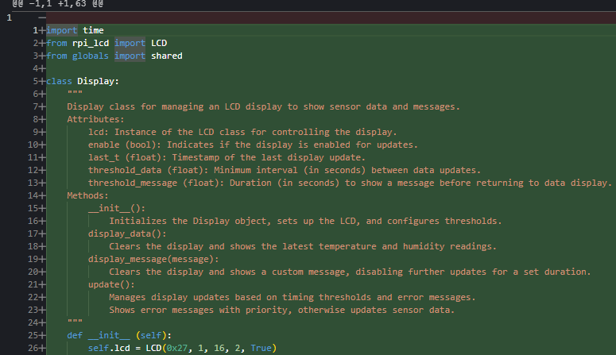
##### Resumen de Codigo
##### Resumen de la clase `Display`
La clase `Display` gestiona un display LCD para mostrar datos de sensores y mensajes en una Raspberry Pi.
##### Atributos principales
- `lcd`: instancia para controlar el LCD físico.
- `enable`: booleano que indica si la pantalla está activa para actualizar datos.
- `last_t`: tiempo del último refresco del display.
- `threshold_data`: intervalo mínimo (0.5 s) entre actualizaciones de datos.
- `threshold_message`: tiempo (5 s) para mostrar un mensaje antes de volver a mostrar datos.
##### Métodos
- `__init__()`: configura el LCD y parámetros iniciales.
- `display_data()`: muestra temperatura y humedad en el LCD.
- `display_message(message)`: muestra un mensaje temporal y pausa la actualización normal.
- `update()`: controla cuándo actualizar el LCD, priorizando mensajes de error antes que datos normales y respetando los tiempos mínimos.
##### Funcionamiento
- Si hay un mensaje de error (`local_error_message`), se muestra con prioridad durante 5 segundos.
- Después de mostrar un mensaje, se vuelve a mostrar la información de sensores actualizada cada 0.5 segundos.
- Permite un control eficiente del display evitando actualizaciones innecesarias y mostrando alertas cuando corresponda.


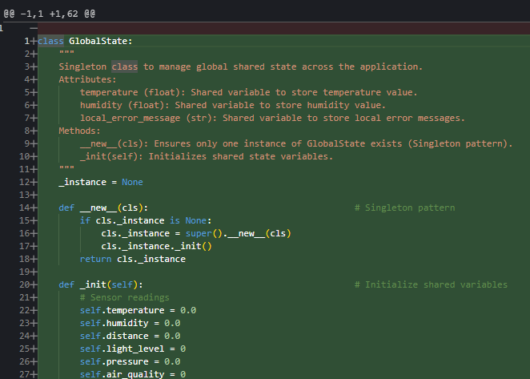
##### Resumen de Codigo
##### Resumen de la clase `GlobalState`
La clase `GlobalState` es un singleton que administra el estado global compartido en toda la aplicación.
##### Propósito
Garantizar una única instancia para mantener valores compartidos entre componentes o módulos.
##### Atributos principales
- **Variables de sensores:**
  - `temperature` (float): valor de temperatura.
  - `humidity` (float): valor de humedad.
  - `distance` (float): distancia medida.
  - `light_level` (int): nivel de luz.
  - `pressure` (float): presión atmosférica.
  - `air_quality` (int): índice de calidad del aire.
- **Mensajes del sistema:**
  - `local_error_message` (str): mensaje local de error.
- **Estado de alertas:** (booleanos)
  - `temperature`, `humidity`, `light`, `air_quality`, `presence`.

- **Estado de actuadores:** (booleanos)
  - `red_led`, `yellow_led`, `green_led`, `blue_led`, `motor_fan`, `buzzer`.

- **Umbrales de alerta configurables:**
  - Máximos y mínimos para temperatura, humedad, luz, calidad de aire y distancia de presencia.
##### Métodos
- `__new__`: Implementa patrón singleton para asegurar una sola instancia.
- `_init`: Inicializa las variables compartidas con valores por defecto.
##### Uso
- Instancia global `shared` para acceder y modificar el estado en cualquier parte del programa.


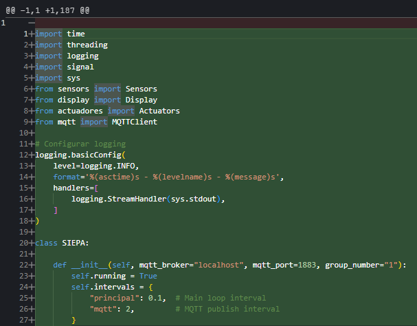
##### Resumen del Codigo
##### Resumen del código `SIEPA`

Este código implementa la aplicación principal `SIEPA` para un sistema embebido con sensores, actuadores, pantalla LCD y comunicación MQTT.
##### Clases y Componentes

##### Clase `SIEPA`
- Controla la lógica principal del sistema.
- Inicializa sensores, actuadores, pantalla y cliente MQTT.
- Maneja la ejecución continua, actualización y comunicación.

##### Funcionalidades clave

- **Inicialización:**
  - Configura sensores, actuadores, display y MQTT.
  - Muestra mensaje inicial en la pantalla.
  - Configura manejo de señales para apagado seguro (SIGINT, SIGTERM).

- **Loop principal (`main_loop`):**
  - Ejecuta tareas periódicas:
    - Lectura de sensores.
    - Control de actuadores según alertas.
    - Actualización de la pantalla.
  - Corre en intervalo definido (`principal`, 0.1s).
  - Ejecuta hilos en segundo plano para MQTT y monitoreo de salud.

- **Publicación MQTT (`mqtt_tasks`):**
  - Envía datos de sensores al broker MQTT cada 2 segundos.
  - Reintenta conexión si se pierde.

- **Monitoreo de salud (`health_check`):**
  - Registra estado del sistema y conexión MQTT cada 5 minutos.
  - Revisa estado cada 30 segundos.

- **Manejo de señales:**
  - Permite apagar el sistema limpiamente con Ctrl+C o terminación del proceso.

- **Limpieza (`_cleanup`):**
  - Desconecta MQTT.
  - Apaga actuadores y limpia sensores.
  - Muestra mensaje de apagado en display.

##### Manejo de errores y logs

- Usa el módulo `logging` para mostrar información, advertencias y errores.
- Captura excepciones para evitar que el sistema caiga abruptamente.
- Mensajes claros para eventos críticos y errores.

##### Configuración

- Parámetros configurables:
  - Broker MQTT (host y puerto).
  - Número de grupo para identificación.
- Definidos al inicio del script.

##### Uso

Al ejecutar, inicia el sistema completo, ejecuta ciclos de lectura y control, publica datos por MQTT y muestra información en la pantalla hasta que se recibe una señal para apagar.

##### Ventajas

- Código modular y organizado.
- Buen manejo de errores y estados.
- Uso de hilos para tareas concurrentes (MQTT y salud).
- Control y monitoreo robustos.
Este diseño es ideal para sistemas IoT embebidos que requieren control en tiempo real y comunicación remota fiable.


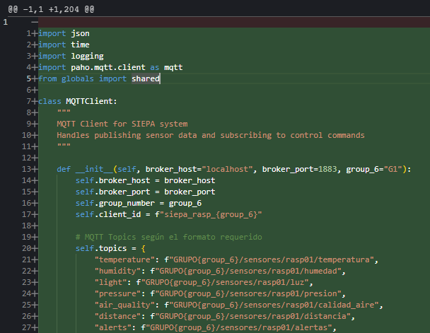
##### Resumen de la clase `MQTTClient`

Esta clase implementa un cliente MQTT para el sistema SIEPA, encargado de publicar datos de sensores y recibir comandos de control remoto.
##### Funcionalidad principal

- **Conexión al broker MQTT**  
  - Se conecta a un broker MQTT definido (`broker_host`, `broker_port`).
  - Usa un client ID con formato específico para el grupo (`siepa_rasp_{group}`).
  - Mantiene conexión activa con reconexión automática.

- **Temas MQTT**  
  - Publica en tópicos estructurados por grupo y tipo de dato, por ejemplo:  
    - Temperatura: `GRUPO{group}/sensores/rasp01/temperatura`  
    - Humedad, luz, presión, calidad de aire, distancia, alertas, actuadores.  
  - Se suscribe al tópico de control remoto para recibir comandos del dashboard.

- **Publicación de datos**  
  - Publica datos de sensores con timestamps (en ms) cada 2 segundos.  
  - Envía estado de alertas y actuadores.  
  - Permite publicar alertas específicas con severidad crítica.

- **Recepción de comandos**  
  - Escucha mensajes en el tópico de control.  
  - Procesa comandos JSON que indican acciones para actuadores (encender/apagar).  
  - Actualiza estado compartido (`shared.remote_commands`) para que otros módulos actúen.

- **Callbacks**  
  - `on_connect`: confirma conexión y suscribe a tópico control.  
  - `on_message`: procesa comandos entrantes.  
  - `on_disconnect`: registra desconexión y actualiza estado.

- **Control de estado**  
  - Variable `connected` indica el estado actual de conexión.

- **Manejo de errores y logs**  
  - Usa `logging` para informar conexiones, desconexiones, errores y operaciones.

##### Uso típico

1. Crear instancia con configuración del broker y grupo.  
2. Llamar `connect()` para iniciar conexión y loop MQTT.  
3. Llamar periódicamente `publish_sensor_data()` para enviar datos.  
4. Recibir comandos automáticamente por callback y actualizar estado.  
5. Llamar `disconnect()` para desconexión ordenada.

Esta clase es esencial para la comunicación bidireccional entre el sistema embebido y un dashboard remoto mediante MQTT, facilitando monitoreo y control en tiempo real.


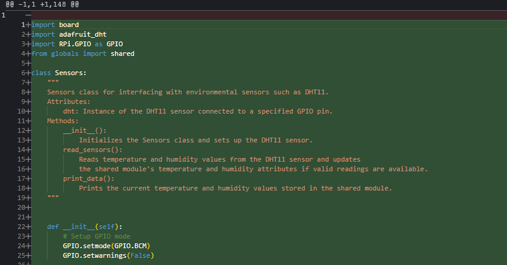
##### Resumen del Codigo

##### Descripción detallada de la clase `Sensors`

##### Visión general:
La clase `Sensors` centraliza el manejo de múltiples sensores conectados a una Raspberry Pi, facilitando su inicialización, lectura periódica, procesamiento de datos y posterior almacenamiento en variables compartidas dentro del módulo `shared`.

##### Sensores soportados:

1. **DHT11 (Temperatura y Humedad)**
   - Se conecta vía GPIO usando la librería `adafruit_dht`.
   - Obtiene temperatura en °C y humedad relativa en %.
   - Permite manejo de excepciones para lecturas inválidas.

2. **HC-SR04 (Ultrasónico - Distancia)**
   - Utiliza un par de pines `TRIG` (salida) y `ECHO` (entrada).
   - Mide distancia basándose en el tiempo de eco del pulso ultrasónico.
   - Calcula la distancia en centímetros considerando la velocidad del sonido.
   - Implementa protección contra lecturas erróneas usando timeout y validación de rango (2cm-400cm).

3. **LDR (Sensor de Luz)**
   - Conectado directamente a un pin digital (GPIO).
   - Se realiza una lectura digital básica para obtener si hay luz o no.
   - El resultado binario se convierte en un porcentaje estimado (0% o 100%).
   - *Nota:* No utiliza ADC, por lo cual la precisión es limitada.

4. **BMP280 (Sensor de Presión)**
   - Actualmente no está implementado físicamente.
   - Simula valores de presión atmosférica (1000 - 1020 hPa) usando la librería `random`.
   - Preparado para futura integración mediante I2C.

5. **MQ135 (Calidad del Aire)**
   - Sensor de calidad del aire, conectado a un pin digital.
   - Interpreta: `0` como buena calidad de aire (100 ppm aprox.), `1` como mala calidad (400 ppm aprox.).
   - El procesamiento es simplificado a dos estados lógicos.

##### Estructura de datos:
Todos los datos de sensores se almacenan en variables globales dentro del módulo `shared` para facilitar el acceso desde otros componentes del sistema.

Variables disponibles:
- `shared.temperature` (°C)
- `shared.humidity` (%)
- `shared.distance` (cm)
- `shared.light_level` (%)
- `shared.pressure` (hPa)
- `shared.air_quality` (ppm aprox.)

##### Métodos principales:

- **`__init__()`**  
  Inicializa la configuración GPIO, establece los pines de cada sensor y resetea los valores de medición.

- **`read_dht11()`**  
  Realiza la lectura de temperatura y humedad, maneja excepciones de lectura del sensor DHT11.

- **`read_ultrasonic()`**  
  Lanza un pulso ultrasónico y mide el tiempo de ida y vuelta para calcular distancia. Incorpora control de timeout para evitar bloqueos.

- **`read_light_sensor()`**  
  Realiza una lectura digital directa del sensor LDR. Convierte la señal binaria a porcentaje estimado.

- **`read_pressure_sensor()`**  
  Simula la lectura de presión atmosférica. Listo para implementación real mediante I2C.

- **`read_air_quality()`**  
  Lee el estado digital del sensor MQ135 y convierte el resultado en dos niveles de calidad de aire.

- **`read_sensors()`**  
  Llama secuencialmente a todos los métodos de lectura de sensores para actualizar el estado global.

- **`print_data()`**  
  Imprime en consola los valores actuales de todos los sensores de forma formateada.

- **`cleanup()`**  
  Libera los recursos de los pines GPIO al finalizar la ejecución o al apagar el programa.

##### Consideraciones adicionales:

- La clase implementa un enfoque modular: cada sensor es leído y gestionado de forma independiente.
- Todas las lecturas están encapsuladas en bloques try-except para aumentar la robustez del sistema frente a fallos de hardware o desconexiones.
- Este módulo es fácilmente extensible para incluir nuevos sensores o modificar los actuales.
- La estructura facilita su integración dentro de proyectos IoT, monitoreo ambiental, automatización o sistemas SCADA básicos.

##### Dependencias:
- `adafruit_dht`: lectura del DHT11.
- `RPi.GPIO`: manejo de pines GPIO de la Raspberry Pi.
- `board`: acceso al pinout lógico de la Raspberry Pi.
- `shared`: módulo propio que mantiene el estado global de los sensores.

##### Resumen conceptual

El módulo `Sensors` convierte una Raspberry Pi en un *hub ambiental completo* capaz de medir temperatura, humedad, distancia, luz, presión (simulada) y calidad del aire, gestionando la adquisición de datos de manera centralizada y robusta para sistemas embebidos o IoT.

# BAKEND

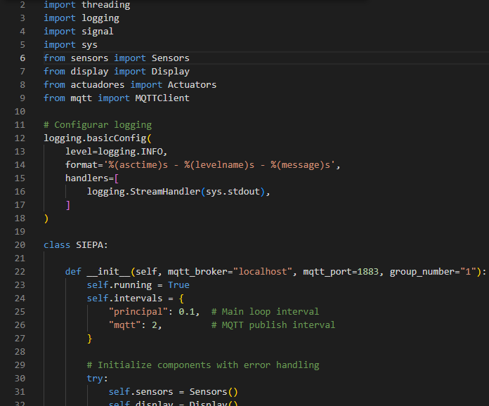
### Resumen del Código: Sistema SIEPA

Este código implementa una aplicación de monitoreo y control llamada **SIEPA**, que integra sensores, actuadores, una pantalla y conectividad MQTT para publicar datos. Está diseñada para funcionar de forma continua, con hilos dedicados para tareas específicas.

#### Módulos y Componentes Importados

- `Sensors`, `Display`, `Actuators`: Módulos personalizados que manejan el hardware.
- `MQTTClient`: Cliente MQTT personalizado.
- `logging`, `signal`, `threading`, `sys`, `time`: Módulos estándar de Python para logging, señales, hilos, sistema y tiempo.

#### Clase Principal: `SIEPA`

####  `__init__`
Inicializa todos los componentes:
- Sensores, actuadores y pantalla.
- Cliente MQTT.
- Configura manejo de señales (`SIGINT`, `SIGTERM`) para un apagado seguro.

#### `run_tasks()`
- Lee datos de sensores.
- Controla actuadores si se detectan alertas.
- Actualiza la pantalla.
- Maneja errores internamente.

#### `mqtt_tasks()`
- Pub

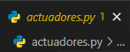
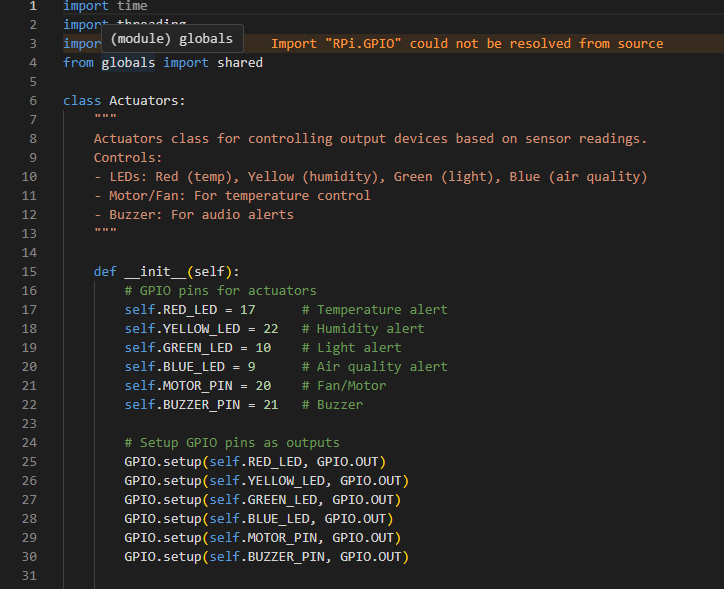
#### Resumen del Código: Clase `Actuators`

Este módulo controla los **actuadores físicos** conectados a una Raspberry Pi, como LEDs, motor/ventilador y buzzer, en respuesta a los datos de sensores. Utiliza el módulo `RPi.GPIO` y datos compartidos desde `globals.shared`.

#### Actuadores Controlados

- 🔴 **LED rojo** → Alerta de temperatura
- 🟡 **LED amarillo** → Alerta de humedad
- 🟢 **LED verde** → Alerta de luz
- 🔵 **LED azul** → Alerta de calidad del aire
- 🌀 **Motor/Ventilador** → Control de temperatura
- 🔊 **Buzzer** → Alertas sonoras

#### Métodos Principales

#### `__init__()`
- Define pines GPIO para los actuadores.
- Configura los pines como salida.
- Inicializa los actuadores apagados.
- Crea timers para apagado automático.

#### `turn_off_all()`
- Apaga todos los actuadores y actualiza su estado en `shared`.

#### `control_led(led_pin, led_name, state)`
- Enciende o apaga un LED.
- Si se enciende, crea un **temporizador de apagado automático (5s)**.

#### `_auto_off_led(led_pin, led_name)`
- Apaga automáticamente un LED después de 5 segundos.

#### `control_motor(state)`
- Enciende o apaga el motor/ventilador.
- Apagado automático tras 5 segundos si se activa.

#### `_auto_off_motor()`
- Apaga automáticamente el motor.

#### `control_buzzer(state, duration=2.0)`
- Enciende o apaga el buzzer.
- Si se activa, se apaga automáticamente después de cierto tiempo (por defecto 2s).

#### `_auto_off_buzzer()`
- Apaga automáticamente el buzzer.

#### `check_alerts_and_control()`
- Analiza los valores de sensores desde `shared`.
- Activa o desactiva actuadores según umbrales predefinidos:
  - Temperatura (LED rojo y motor)
  - Humedad (LED amarillo)
  - Luz (LED verde)
  - Calidad del aire (LED azul + buzzer)
  - Presencia (solo estado lógico, sin actuador directo)

#### `cleanup()`
- Apaga todos los actuadores.
- Cancela todos los timers activos.

#### Dependencias
- `RPi.GPIO` → Control de pines GPIO.
- `threading.Timer` → Timers para apagado automático.
- `shared` (desde `globals`) → Estado compartido de sensores, umbrales y alertas.

#### Comportamiento Destacado

- Los actuadores se apagan automáticamente después de un tiempo.
- Sistema modular y reutilizable.
- Permite integrarse con un sistema mayor de monitoreo (como `SIEPA`).


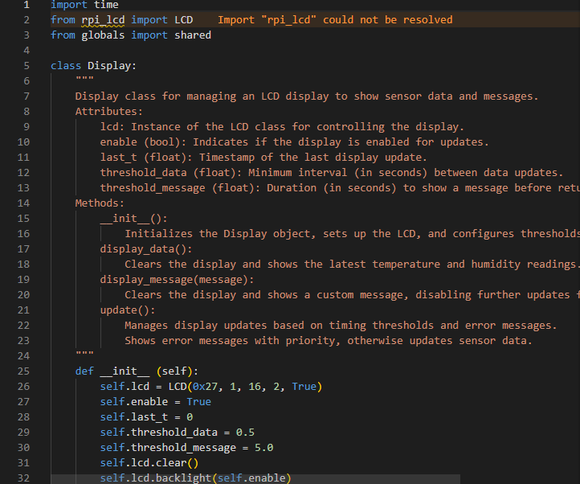

#### Resumen del Código: Clase `Display`

Este módulo gestiona una pantalla LCD conectada a una Raspberry Pi para mostrar información en tiempo real sobre sensores, como temperatura y humedad, o para mostrar mensajes de alerta.

#### Clase `Display`

#### Atributos
- `lcd` → Instancia de la clase `LCD` (`rpi_lcd`), que controla la pantalla.
- `enable` (`bool`) → Indica si la pantalla está habilitada para actualizarse.
- `last_t` (`float`) → Último timestamp en que se actualizó la pantalla.
- `threshold_data` (`float`) → Tiempo mínimo (en segundos) entre actualizaciones de datos.
- `threshold_message` (`float`) → Duración (en segundos) que se muestra un mensaje antes de volver a mostrar datos.

#### Métodos

#### `__init__()`
- Inicializa el objeto `LCD`.
- Configura la retroiluminación y limpia la pantalla.
- Define umbrales de actualización (`threshold_data`, `threshold_message`).

#### `display_data()`
- Limpia la pantalla y muestra:
  - Temperatura actual (`Temp: XX.XC`)
  - Humedad actual (`Hum: XX.X%`)
- Guarda el tiempo de actualización.

#### `display_message(message)`
- Limpia la pantalla y muestra un mensaje personalizado en la primera línea.
- Desactiva actualizaciones hasta que se cumpla el `threshold_message`.

### `update()`
- Decide qué mostrar:
  - Si hay un mensaje de error (`shared.local_error_message`), lo muestra con prioridad.
  - Si no, muestra los datos de sensores.
- Respeta los intervalos de tiempo definidos para evitar sobrecargar el LCD.

#### Comportamiento Inteligente

- Da **prioridad a mensajes de error** si existen.
- Vuelve automáticamente a mostrar los datos tras mostrar un mensaje.
- Controla el número de actualizaciones por segundo para evitar parpadeos o sobreescritura rápida.

#### Dependencias

- `rpi_lcd.LCD` → Control de la pantalla LCD.
- `globals.shared` → Variables compartidas con los sensores (ej. temperatura, humedad, errores).

#### Uso Típico

``python
display = Display()
dis


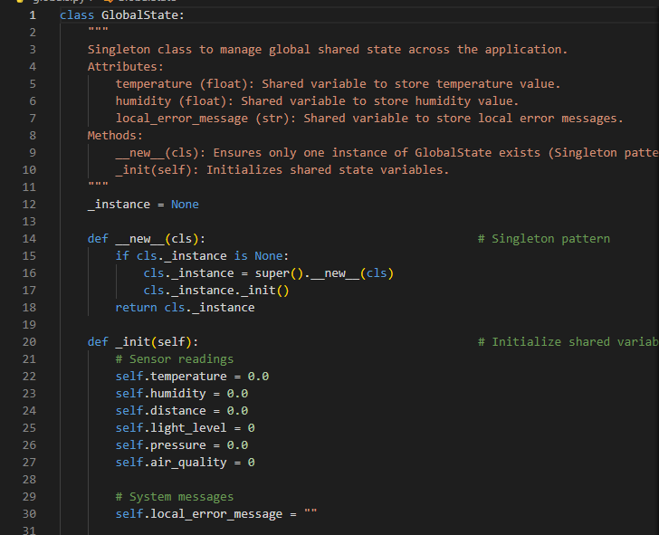
#### Resumen del Código: Clase `GlobalState` (Estado Global Compartido)

Este módulo implementa un **patrón Singleton** para mantener un **estado compartido** entre sensores, actuadores y componentes de interfaz, como pantallas LCD o sistemas de alerta.
#### Clase `GlobalState`

#### Propósito
Proporcionar variables globales consistentes y accesibles en toda la aplicación sin múltiples instancias del estado.

#### Patrón Utilizado
- **Singleton**: Solo se crea una única instancia de `GlobalState`.
- Se accede a esta instancia mediante `shared = GlobalState()`.
#### Atributos

#### Lecturas de sensores
- `temperature` (`float`): Temperatura actual en °C.
- `humidity` (`float`): Humedad relativa en %.
- `distance` (`float`): Distancia detectada por sensor de ultrasonido (presencia).
- `light_level` (`int`): Nivel de luz en %.
- `pressure` (`float`): Presión atmosférica.
- `air_quality` (`int`): Índice de calidad del aire.

#### Mensajes del sistema
- `local_error_message` (`str`): Mensaje de alerta o advertencia a mostrar en pantalla.

#### Estado de alertas (booleanos)
```python
self.alert_status = {
    'temperature': False,
    'humidity': False,
    'light': False,
    'air_quality': False,
    'presence': False
}
```

#### Estado de actuadores (booleanos)
```python
self.actuator_status = {
    'red_led': False,
    'yellow_led': False,
    'green_led': False,
    'blue_led': False,
    'motor_fan': False,
    'buzzer': False
}
```

#### Umbrales configurables
```python
self.thresholds = {
    'temperature_max': 30.0,
    'temperature_min': 15.0,
    'humidity_max': 80.0,
    'humidity_min': 30.0,
    'light_min': 20,
    'air_quality_max': 300,
    'presence_distance': 50.0
}
```
#### Métodos

#### `__new__(cls)`
- Crea una única instancia (`Singleton`).
- Si ya existe, retorna la misma.

#### `_init(self)`
- Inicializa todas las variables compartidas, incluidos sensores, alertas, actuadores y umbrales.

#### Instanciación Global
```python
shared = GlobalState()
```
Se recomienda importar `shared` en otros módulos para acceder a las variables globales.

#### Uso Típico

```python
from globals import shared

if shared.temperature > shared.thresholds['temperature_max']:
    shared.alert_status['temperature'] = True
    shared.local_error_message = "High Temp!"
```

#### Beneficios
- Centraliza el estado de sensores, actuadores y configuración.
- Facilita la comunicación entre módulos.
- Previene inconsistencias o duplicación de variables.

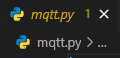
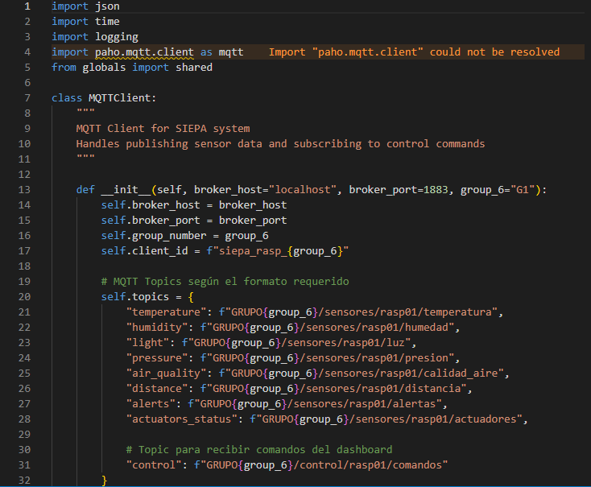
#### Resumen del Código: Clase `MQTTClient` (Cliente MQTT para SIEPA)

Este módulo gestiona la **conexión MQTT** entre el sistema SIEPA (por ejemplo, en una Raspberry Pi) y un servidor/broker. Permite la **publicación de datos de sensores**, la **recepción de comandos de control** y el monitoreo en tiempo real desde una plataforma de dashboard.

#### Clase `MQTTClient`

#### Propósito
- Publicar datos de sensores (temperatura, humedad, etc.).
- Escuchar comandos de control remoto (actuadores).
- Reportar estados de alerta y actuadores.
- Mantener conexión constante con el broker MQTT.

#### Parámetros de Inicialización

```python
MQTTClient(broker_host="localhost", broker_port=1883, group_6="G1")
```

- `broker_host`: IP o hostname del broker MQTT.
- `broker_port`: Puerto MQTT (default 1883).
- `group_6`: Identificador de grupo (`G1`, `G2`, etc.) usado en los *topics*.

#### Topics utilizados

```python
self.topics = {
    "temperature":    "GRUPOG1/sensores/rasp01/temperatura",
    "humidity":       "GRUPOG1/sensores/rasp01/humedad",
    "light":          "GRUPOG1/sensores/rasp01/luz",
    "pressure":       "GRUPOG1/sensores/rasp01/presion",
    "air_quality":    "GRUPOG1/sensores/rasp01/calidad_aire",
    "distance":       "GRUPOG1/sensores/rasp01/distancia",
    "alerts":         "GRUPOG1/sensores/rasp01/alertas",
    "actuators_status": "GRUPOG1/sensores/rasp01/actuadores",
    "control":        "GRUPOG1/control/rasp01/comandos"
}
```
##### Método
##### `connect()`
Conecta al broker MQTT y comienza a escuchar mensajes.

##### `disconnect()`
Finaliza la conexión MQTT limpiamente.

##### `publish_sensor_data()`
- Publica cada 2 segundos (`publish_interval`) los valores de sensores en su topic correspondiente.
- Publica también el estado actual de:
  - Alertas (`shared.alert_status`)
  - Actuadores (`shared.actuator_status`)

##### `publish_alert(alert_type, message, value)`
Publica una alerta crítica con tipo, mensaje y valor relacionado.

##### `on_message(...)`
Maneja los mensajes entrantes desde el topic de control.
- Procesa comandos con formato JSON como:
```json
{
  "type": "actuator_control",
  "device": "motor_fan",
  "action": "on"
}
```
##### `is_connected()`
Retorna `True` si está conectado al broker.
#### Atributos Internos

- `client`: Instancia de `paho.mqtt.client.Client`.
- `connected`: Estado actual de conexión (`True`/`False`).
- `last_publish_time`: Timestamp del último envío de datos.
- `publish_interval`: Intervalo mínimo entre publicaciones (segundos).

#### Uso Típico

```python
from mqtt_client import MQTTClient

mqtt_client = MQTTClient(group_6="G3")
mqtt_client.connect()

while True:
    mqtt_client.publish_sensor_data()
    time.sleep(1)
```
#### Requiere

- `paho-mqtt`
- `logging`
- `json`
- `time`
- Módulo `globals.py` con la instancia `shared`

#### Seguridad / Validación

- Los comandos remotos se validan contra la lista `shared.actuator_status`.
- Toda entrada MQTT es parseada con manejo de errores (`try/except`).

#### Formato de Publicación de Datos

```json
{
  "value": 23.5,
  "unit": "°C",
  "timestamp": 1723456789000
}
```
¿Quieres que combine este resumen con los de `Display` y `GlobalState` en un solo documento tipo README final del proyecto? También puedo generar un diagrama del flujo de datos o dependencias si lo necesitas. 

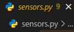
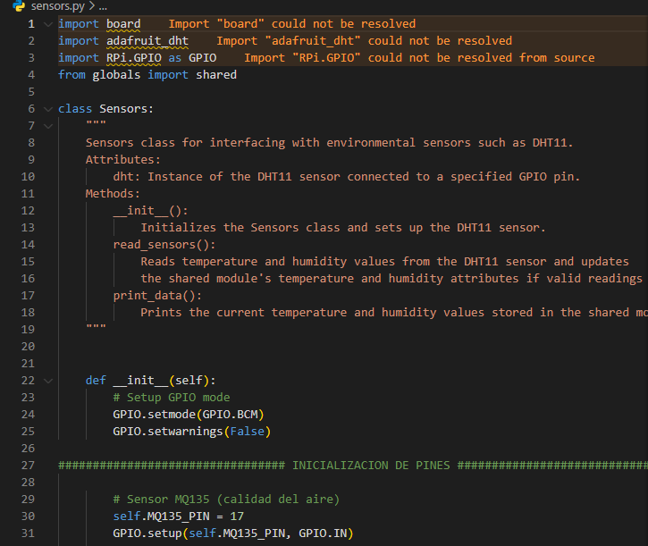
#### Resumen del Código: Clase `Sensors` (Módulo de Sensores para SIEPA)

Este módulo encapsula la lectura de datos ambientales a través de sensores conectados a una **Raspberry Pi**, incluyendo **temperatura, humedad, luz, presión, calidad del aire y distancia**. Integra directamente con el estado global del sistema vía el objeto `shared`.

#### Clase `Sensors`

#### Propósito
- Leer datos desde sensores físicos conectados a GPIO.
- Actualizar valores globales en el objeto `shared`.
- Imprimir o simular lecturas en consola.
- Preparar pines GPIO de entrada/salida.

#### Pines Utilizados

| Sensor         | PIN GPIO | Modo       |
|----------------|-----------|------------|
| **DHT11** (Temp/Humedad) | `D27` (board) | Digital |
| **MQ135** (Calidad aire) | `17`          | Entrada |
| **HC-SR04** (Distancia)  | `TRIG=23`, `ECHO=24` | Salida/Entrada |
| **LDR** (Luz)            | `18`          | Entrada (digital simulada) |

>**Nota**: La presión es simulada actualmente (se espera usar un BMP280 vía I2C en el futuro).

#### Métodos Principales

#### `__init__(self)`
- Inicializa todos los pines GPIO.
- Define los pines y objetos de sensores.
- Establece los valores iniciales en `shared`.

#### Lecturas Individuales

- `read_dht11()`: Lee temperatura y humedad (sensor DHT11).
- `read_ultrasonic()`: Mide distancia usando sensor ultrasónico HC-SR04.
- `read_light_sensor()`: Detecta nivel de luz (0 o 100%) vía LDR.
- `read_pressure_sensor()`: Simula lectura de presión (requiere BMP280 real).
- `read_air_quality()`: Evalúa la calidad del aire (MQ135, binaria).

#### `read_sensors()`
Llama a todos los métodos de lectura de sensores en secuencia. Actualiza el estado compartido.

#### `print_data()`
Muestra en consola el estado actual de todos los sensores:

```text
Temp: 23.5°C | Humidity: 45.0% | Distance: 37.2cm | Light: 100% | Pressure: 1012.3hPa | Air Quality: 100
```
#### `cleanup()`
Limpia los recursos de los pines GPIO al finalizar la ejecución del programa.

#### Dependencias

- `RPi.GPIO`: Control de pines GPIO.
- `board` + `adafruit_dht`: Lectura del sensor DHT11.
- `globals.shared`: Módulo global que guarda los estados de sensores.

#### Lógica Importante

- Simulación de sensores donde no hay hardware real (presión).
- MQ135 se trata como binario: `0 = buena`, `1 = mala` calidad del aire.
- Uso de `try/except` para manejar errores de sensores desconectados o fallos en lectura.
- LDR es leído de forma digital (no analógica), lo cual es una aproximación por la falta de ADC nativo en Raspberry Pi.

#### Notas y Mejoras Futuras

- Añadir soporte real para sensor **BMP280** (presión) vía I2C.
- Sustituir lectura digital del **LDR** por un **ADC externo** (ej. MCP3008) para precisión.
- Agregar filtros o validaciones de lectura (como evitar falsos positivos).

#### Ejemplo de Uso

```python
from sensors import Sensors

sensor_module = Sensors()
sensor_module.read_sensors()
sensor_module.print_data()
sensor_module.cleanup()
```
¿Quieres ahora que combine este resumen con los anteriores (`GlobalState`, `MQTTClient`) para crear una documentación general del sistema? También puedo generar un README.md completo o un diagrama de arquitectura.
